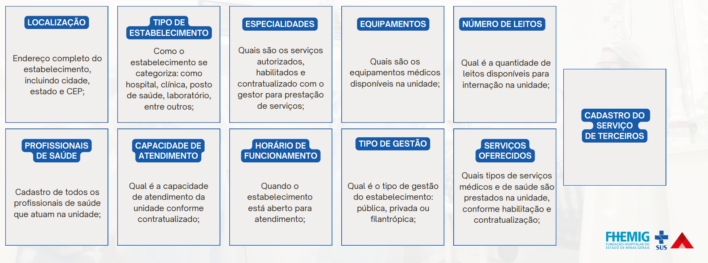

# Sistema de informação hospitalar do SUS (SIH/SUS)

Instituído pelo Ministério da Saúde e regulamentado pela [**Lei nº 8.080/1990**](https://www.planalto.gov.br/ccivil_03/leis/l8080.htm), o **SIH/SUS** é o sistema responsável pelo processamento de internações hospitalares. Todas as internações geram uma **Autorização de Internação Hospitalar (AIH)**, que registra o motivo, os procedimentos, o diagnóstico, a duração e os recursos utilizados durante a internação. O SIH/SUS centraliza esses dados para fins de faturamento, monitoramento e auditoria.  

É regido por várias legislações que visam garantir a qualidade, a transparência e a conformidade nos processos hospitalares e administrativos. A seguir estão os principais elementos e diretrizes legais:

---

## Classificação e compatibilidades dos procedimentos – SIGTAP
A tabela **SIGTAP** define os procedimentos, materiais e medicamentos que podem ser cobrados, limitando a quantidade e compatibilidade com diagnósticos (**CID**) e condições específicas do paciente. 

A **Portaria nº 2.848/2007** regulamenta o uso da SIGTAP, estabelecendo padrões para registros e processamento de informações de internações, incluindo limites de quantidade e faixa etária. Esse controle permite auditorias automáticas que identificam **glosas** e inconsistências.

---

## Cadastro Nacional de Estabelecimentos de Saúde (CNES)
O **Cadastro Nacional de Estabelecimentos de Saúde (CNES)** é fundamental para que um serviço de saúde realize o faturamento no Sistema Único de Saúde (**SUS**). 

O CNES registra e categoriza os estabelecimentos e profissionais, garantindo a conformidade com as exigências do Ministério da Saúde para o recebimento de repasses e pagamento de procedimentos.

!!! info "Dica Importante"
    O CNES deve ser atualizado regularmente para evitar bloqueios no faturamento.

### Principais requisitos e etapas para o cadastro no CNES com fins de faturamento:
- Identificação do estabelecimento, com informações detalhadas sobre sua localização e estrutura.
- Registro dos profissionais de saúde e sua respectiva classificação de atuação.
- Adequação dos serviços oferecidos às normas estabelecidas pelo Ministério da Saúde.
- Atualização constante das informações no sistema para garantir a validade do cadastro.

<figure markdown>
  { width="800" }
  <figcaption>Informações disponíveis no CNES.</figcaption>
</figure>

### Cadastro do estabelecimento
Cada estabelecimento de saúde, como hospitais, clínicas e laboratórios, deve estar registrado no **CNES** com dados completos, incluindo:

- **CNPJ**, endereço e natureza jurídica.
- **Estrutura física**, equipamentos e leitos.

A classificação do estabelecimento inclui especificações como:

- **Tipo de unidade** (ex: hospital geral, clínica especializada).
- **Tipo de atendimento oferecido** (ambulatorial, internação, UTI, etc.).

!!! warning "Atualização do CNES"
    O **gestor local** (municipal ou estadual) é responsável por aprovar o cadastro e as atualizações de informações, conforme exigências de habilitação do **SUS**.

---

### Cadastro dos profissionais de saúde
Cada profissional de saúde precisa ter um registro atualizado no **CNES**, incluindo:

- **CPF**.
- **Número do Conselho de Classe** (CRM, CRO, etc.).
- **Especialização**.

### Classificação Brasileira de Ocupações (CBO)
O **CBO** é essencial para definir o papel de cada profissional no estabelecimento. A correspondência entre o **CBO** e os procedimentos que podem ser faturados é verificada automaticamente no sistema.

!!! warning "Obrigatório o cadastro de profissionais adequados"

    Profissionais com especializações específicas são necessários para a autorização de procedimentos de **alta complexidade**.

---

### Cadastro de serviços e habilitações
Para que o estabelecimento possa realizar certos procedimentos de **alta complexidade** ou especializados, ele deve ser **habilitado no CNES**. Exemplos de serviços que exigem habilitação:

- Terapia Intensiva (**UTI**).
- Terapia Nutricional.
- Oncologia.
- Serviços de Hemodiálise.

Cada **habilitação** permite o faturamento de **procedimentos específicos**. O não cumprimento das especificações pode resultar em **rejeição ou glosa**.

---

### Cadastro de leitos
Os leitos devem ser **identificados por tipo**, conforme as diretrizes estabelecidas pelo **Ministério da Saúde**. Exemplos:

- **Enfermaria**.
- **UTI** (Unidade de Terapia Intensiva).
- **UCI Neonatal** (Unidade de Cuidados Intermediários).

A correta categorização desses leitos garante que os pacientes sejam **alocados adequadamente**, conforme suas **necessidades clínicas** e o tipo de atendimento que precisam.

---

### Cadastro de equipamentos e estrutura
Equipamentos de **uso crítico**, como **tomógrafos** e **ultrassonógrafos**, devem estar registrados no **CNES**, especificando:
- **Capacidade**.
- **Compatibilidade com o SUS**.

O uso de **materiais e equipamentos** vinculados a códigos específicos (como **órteses e próteses**) também deve ser compatível com a **Tabela SIGTAP** para fins de faturamento.

---

!!! warning "Regulamentação de auditorias e controle de qualidade"
    A **Portaria GM/MS nº 312/2002** define que todos os serviços processados no **SIH/SUS** estejam sujeitos à auditoria, realizada por **auditores médicos** ou **de gestão do SUS**. Essas auditorias avaliam a conformidade dos registros de internação, revisando as **AIHs** e o **Espelho da AIH** para garantir que todos os serviços estejam de acordo com os protocolos estabelecidos.

---

## Validade da AIH
A **validade da AIH** é de até **três meses**, contados a partir da alta do paciente. Dentro desse período, ela pode ser apresentada para processamento. 

!!! failure "Prazo das AIH's"
    - Se a **AIH for enviada após o quarto mês da alta**, será definitivamente **rejeitada**.
    - No entanto, se for **apresentada e rejeitada dentro dos primeiros quatro meses**, ainda poderá ser **reapresentada até o sexto mês após a alta**.

---

## Processamento e envio das AIHs
A **portaria** especifica **prazos** para que os registros das internações sejam enviados ao sistema do **SIH/SUS** e estabelece as **consequências para registros incompletos ou incorretos**, incluindo rejeições e a necessidade de reapresentação para ajuste.

---

## Profissionais envolvidos para fins de faturamento
No **SUS**, o processo de **faturamento hospitalar** envolve uma **equipe multidisciplinar** com funções específicas para garantir a precisão e a conformidade com as normas de faturamento e gestão.

| **Profissional**            | **Descrição** |
|-----------------------------|--------------|
| **Profissional Executante** | Responsável por realizar o procedimento no paciente. Deve estar devidamente cadastrado no estabelecimento de saúde onde o atendimento está sendo prestado. |
| **Autorizador** | Profissional responsável por analisar os laudos médicos para a emissão da **AIH** e decidir se a internação ou o procedimento será autorizado. |
| **- Médicos e cirurgiões-dentistas** | Para procedimentos buco-maxilo. |
| **- Enfermeiras obstetras** | No caso de partos normais realizados por enfermeiras. |
| **- Gestores** | Conforme critério da administração, para permitir procedimentos especiais. |
| **Auditor** | Atua em duas principais funções: |
| **- Auditor Médico** | Médico responsável por analisar tecnicamente a assistência prestada, sem avaliar diretamente o desempenho do profissional. |
| **- Auditor de Gestão do SUS** | Profissional de nível superior capacitado para avaliar a gestão dos recursos e processos do sistema. Essa função pode ser exercida por diversos profissionais escolhidos pelo gestor, não sendo restrita a médicos. |

!!! info "Auditor Médico"
    A figura do auditor médico é **fundamental** para garantir que o processo de faturamento seja feito dentro das normas, **antes** do encaminhamento para o gestor municipal, assim evitando glosas.

---

## Classificação Brasileira de Ocupações (CBO)
O **CBO** é obrigatório para especificar os **profissionais habilitados** a realizar procedimentos. Desde a implementação do **CNES** em 2003, o **CBO** tem sido usado para categorizar as ocupações dos profissionais nos estabelecimentos de saúde, sendo admitido pelo **Ministério do Trabalho e Emprego**.

> O **CBO reflete a ocupação do profissional no estabelecimento de saúde**, mas **não é sinônimo de especialidade**.  
Para **procedimentos de alta complexidade**, é necessário que o **médico seja especialista**. O sistema **SIH/SUS rejeitará registros** se o CBO informado **não corresponder ao que requer a SIGTAP**. Portanto, o profissional deve estar **cadastrado corretamente no CNES** para garantir a aprovação dos procedimentos.

---

## Especialidades médicas
As especialidades médicas abrangem uma variedade de áreas, cada uma focada em diferentes aspectos do cuidado à saúde. Algumas das principais especialidades médicas incluem:

| **Especialidade Médica**           | **Descrição** |
|------------------------------------|--------------|
| **Cardiologia**                   | Estudo e tratamento do coração e sistema cardiovascular. |
| **Dermatologia**                   | Cuidados com a pele, cabelos e unhas. |
| **Gastroenterologia**              | Tratamento de problemas no sistema digestivo. |
| **Neurologia**                     | Diagnóstico e tratamento de distúrbios neurológicos. |
| **Ortopedia**                      | Especializada no sistema musculoesquelético (ossos, articulações e músculos). |
| **Oftalmologia**                   | Cuidados com a visão e problemas oculares. |
| **Oncologia**                      | Estudo e tratamento de cânceres. |
| **Pediatria**                      | Cuidado médico para crianças e adolescentes. |
| **Psiquiatria**                    | Diagnóstico e tratamento de doenças mentais e emocionais. |
| **Ginecologia e Obstetrícia**      | Saúde da mulher, incluindo gestação e parto. |
| **Endocrinologia**                 | Distúrbios hormonais, como diabetes e problemas de tireoide. |
| **Nefrologia**                     | Cuidado do sistema urinário e dos rins. |
| **Urologia**                       | Doenças do sistema urinário e do sistema reprodutor masculino. |
| **Infectologia**                   | Prevenção e tratamento de doenças infecciosas. |
| **Medicina de Emergência**         | Cuidado imediato para doenças e ferimentos agudos. |
| **Medicina Intensiva**             | Tratamento de pacientes críticos em **UTI** (Unidade de Terapia Intensiva). |

---

## Orientações para o faturamento conforme o manual técnico do SIH/SUS
Este tópico orienta sobre o cumprimento das normatizações do **SIH/SUS**, suas características e seu processamento, auxiliando **gestores estaduais e municipais**, além de técnicos das unidades.

### Objetivos principais:
- **Padronização dos registros hospitalares.**
- **Faturamento preciso e adequado.**
- **Transparência e controle dos serviços prestados.**
- **Aprimoramento da gestão hospitalar.**
- **Monitoramento da saúde pública.**
- **Garantia de continuidade do cuidado ao paciente.**
- **Redução de fraudes e erros.**

!!! info "Importância das diretrizes"
    As diretrizes do **manual técnico** são essenciais para que a unidade **fature corretamente** os serviços prestados ao **SUS**, assegurando que os procedimentos sejam codificados e registrados de acordo com as normas para pagamento adequado.

---

## Nova AIH
A **Autorização de Internação Hospitalar (AIH)** é gerada quando há necessidade de continuar a internação de um paciente por um período maior do que o previsto na **AIH original**. Esse processo é chamado de **prorrogação da AIH**, garantindo a continuidade do atendimento hospitalar e o faturamento correto.

!!! question "Quando é necessária uma nova AIH?"
    - A internação ultrapassa o tempo inicialmente autorizado pela AIH original.
    - Há necessidade de tratamentos adicionais ou procedimentos mais complexos.
    - O quadro clínico do paciente justifica uma prorrogação (ex: complicações, cuidados intensivos).

---

## Como solicitar a nova AIH?
1. **Avaliação do quadro clínico:** O médico responsável avalia o estado do paciente e justifica a necessidade da continuidade da internação.
2. **Elaboração de justificativa e documentação:** Um novo laudo médico é elaborado, detalhando:
   - Condição atual do paciente.
   - Procedimentos realizados.
   - Razão para a prorrogação.
   - Exames, evolução médica e relatórios de enfermagem anexados como comprovação.
3. **Solicitação à central de regulação do SUS:** A equipe administrativa do hospital envia a solicitação de prorrogação, que será analisada.
4. **Emissão da nova AIH:** Se aprovada, é gerada uma nova AIH com novo período de internação autorizado.
5. **Registro e faturamento:** A nova AIH é anexada ao prontuário do paciente e registrada para controle de custos e continuidade do faturamento.

---

!!! success "Importância da nova AIH"
    A **nova AIH** assegura que o hospital seja devidamente **compensado** pelo tempo adicional de internação, garantindo que o paciente **receba o cuidado necessário sem interrupções**. Além disso, é essencial para manter a **transparência administrativa** e o **controle dos recursos do SUS**.

---

## Principais casos para a emissão de uma nova AIH
Para a **gestão de faturamento na FHEMIG**, é essencial seguir as regras e legislações estabelecidas pela **Secretaria Municipal de Saúde (SMS)** e outras entidades reguladoras. 

Essas diretrizes garantem a **conformidade e eficiência** no processo de faturamento e asseguram que todos os serviços prestados estejam dentro das normas do **SUS**.

| **Principais casos para emissão de uma nova AIH** | **Critério** |
|--------------------------------------------------|-------------|
| **Em cirurgia** | Desde que uma segunda cirurgia não ocorra no mesmo ato anestésico, inclusive reoperação |
| **Obstetrícia para cirurgia e vice-versa** | Exceto quando se tratar de ato realizado durante o mesmo ato anestésico |
| **Clínica médica para obstetrícia** | Em casos em que houver parto e/ou intervenção cirúrgica obstétrica por motivo não relacionado à internação |
| **Obstetrícia para obstetrícia** | Quando houver duas intervenções obstétricas em tempos diferentes |
| **Obstetrícia para clínica médica** | Quando o parto ou intervenção cirúrgica, após esgotado o tempo de permanência estabelecido na tabela |
| **Cirurgia para clínica médica** | Nos casos em que, esgotado o tempo de permanência do procedimento, o paciente apresentar quadro clínico não decorrente ou consequente ao ato cirúrgico |
| **Clínica médica para cirurgia** | Nos casos clínicos em que haja uma intercorrência cirúrgica desde que não tenha relação com a patologia clínica, após ultrapassar a metade da média de permanência. Nesses casos, fechar a AIH clínica |
| **Paciente sob cuidados prolongados ou psiquiatria** | Quando, durante a internação, o paciente desenvolver quadro clínico que necessite de cirurgia ou tratamento em unidade de cuidados intensivos |
| **Paciente clínico que necessite ser reinternado** | Quando o paciente apresenta a mesma patologia três dias após alta hospitalar |
| **Paciente em psiquiatria, sob cuidados prolongados, reabilitação, internações domiciliares e tuberculose** | Conforme as normas de cada especialidade. Quando, durante a internação, o paciente desenvolver quadro clínico que necessite de cirurgia ou tratamento em unidade de cuidados intensivos |
| **Politraumatizados e cirurgias múltiplas** | No caso de o procedimento principal ser tratamento em Politraumatizado ou com Cirurgia Múltipla e forem realizados mais de 05 (cinco) procedimentos principais, deve ser emitida nova AIH com motivo de apresentação 5.1. ENCERRAMENTO |
| **Procedimentos clínicos cobrados por diárias** | Especialmente quando o paciente necessita de internação prolongada ou contínua |
| **Internações em CTI (Centro de Terapia Intensiva)** | Admite-se a abertura de uma nova AIH a cada competência para cobrança das diárias |
| **Encerramento administrativo** | Uma medida técnica que garante a continuidade e a adequação do faturamento, mesmo em internações prolongadas ou de alta complexidade |

---

## Mudança de Procedimento

A mudança de procedimento em uma AIH é necessária quando o paciente apresenta um quadro clínico que exige alterações nos procedimentos inicialmente previstos. Essa mudança é regulamentada no Manual de Procedimentos do SUS e envolve atualizações no prontuário e no sistema de faturamento. Abaixo estão as diretrizes principais para uma mudança de procedimento:

### Diretrizes para Mudança de Procedimento:

| **Etapa**                                  | **Descrição** |
|--------------------------------------------|--------------|
| **Identificação da necessidade de mudança** | O médico responsável identifica que o tratamento ou procedimento inicial deve ser alterado.   Isso pode ocorrer devido a uma complicação, mudança no diagnóstico, necessidade de um procedimento adicional ou uma intervenção de maior complexidade. |
| **Emissão de novo laudo e justificativa**  | O médico emite um laudo atualizado justificando a alteração do procedimento.   O laudo deve detalhar o novo quadro clínico e as necessidades específicas.   Deve ser documentado no prontuário e assinado pelo profissional responsável. |
| **Solicitação de autorização pela Central de Regulação** | O hospital solicita uma nova autorização à Central de Regulação do SUS.   A Central analisa a justificativa e aprova a alteração.   Dependendo da mudança, pode ser necessária uma nova AIH se o procedimento for significativamente diferente do original. |
| **Atualização da AIH**                      | Se a mudança for aprovada, a AIH é atualizada com o novo procedimento.   A numeração da AIH permanece a mesma, desde que o quadro clínico se encaixe nas diretrizes de alteração.   Caso o novo procedimento exija um tipo diferente de atendimento, pode ser necessária a emissão de uma nova AIH. |
| **Documentação e Faturamento**              | A mudança de procedimento deve ser registrada no prontuário do paciente.   Todos os diagnósticos, intervenções e justificativas devem ser detalhados.   Os códigos de faturamento são atualizados para garantir o correto ressarcimento. |

---

!!! example "Exemplos Comuns de Mudança de Procedimento"
    - **Complicações pós-cirúrgicas:** Um paciente que passa por cirurgia e desenvolve uma infecção pode precisar de drenagem ou antibioticoterapia, que não estavam incluídas inicialmente.

    - **Agravamento do quadro clínico:** Um paciente com diagnóstico inicial de pneumonia que evolui para insuficiência respiratória e requer internação em UTI.

    - **Necessidade de procedimentos adicionais:** Inserção de dispositivos como cateteres ou drenos, ou uma nova cirurgia devido a complicações.

---

!!! warning "Importância da Mudança de Procedimento no SUS"
    Essa flexibilidade no ajuste dos procedimentos assegura que o paciente receba o cuidado necessário conforme seu quadro clínico evolui. Ao mesmo tempo, o processo permite que o SUS mantenha o controle sobre o uso dos recursos, garantindo transparência e adequação no financiamento dos serviços prestados.

---

## Tipos de AIH

As Autorizações de Internação Hospitalar (AIH) são classificadas em diferentes tipos para atender às especificidades dos tratamentos e à duração da internação. Entre os principais tipos estão:

| **Tipo de AIH**          | **Descrição** |
|-------------------------|--------------|
| **AIH 1 - Inicial**      | Autoriza a primeira internação de um paciente.   Emitida no momento da admissão.   Cobre o período estimado para o diagnóstico e tratamento. |
| **AIH 5 - Continuidade** | Utilizada quando o tratamento precisa ser prolongado além da AIH inicial.   Essencial para garantir o acompanhamento em casos de internação prolongada, doenças crônicas e condições complexas. |

---

## Instrumento de Registro

Os procedimentos relacionados aos pacientes em regime de internação ou hospital-dia são registrados por meio de três tipos de AIH:

| **Tipo de AIH**            | **Descrição** |
|----------------------------|--------------|
| **AIH (procedimento principal)** | Principal motivo da internação. Exige autorização e é registrado nos campos "procedimento solicitado" e "procedimento realizado". |
| **AIH (procedimento especial)** | Procedimentos que não geram AIH, mas agregam valor ao procedimento principal. Dependendo da política do gestor, podem exigir autorização. |
| **AIH (procedimento secundário)** | Não gera AIH nem requer autorização. Apenas informativo no campo "procedimentos realizados", sem custo financeiro direto. |

---

!!! info "Procedimento Principal com Valor Zerado"

    - Diz respeito a intervenções cirúrgicas ou tratamentos essenciais, mas que não geram custo financeiro direto no sistema de financiamento do SUS.  
    - Isso é comum em situações de alta complexidade, como cirurgias em politraumatizados.

---

## Classificação Internacional de Doenças (CID)

Na **CID**, os diagnósticos são divididos em:

| **Tipo de Diagnóstico**       | **Descrição** |
|------------------------------|--------------|
| **Diagnóstico Principal**     | Condição médica que justifica a internação do paciente.   Pode diferir do diagnóstico inicial após exames e novas informações. |
| **Diagnóstico Secundário**    | Condições coexistentes no momento da admissão ou adquiridas durante a internação.   Podem influenciar o curso do tratamento e o tempo de internação. |

---

##  Registro de Diárias

| **Tipo de Diária** | **Descrição** |
|-------------------|--------------|
| **Diária padrão** | Período de até 24 horas de internação hospitalar. |
| **Diária de acompanhante** | Pacientes têm direito a um acompanhante durante a internação. |
| **Diária de UTI** | Registro específico para internação em Unidade de Terapia Intensiva. |
| **Diária de UCI Neonatal** | Aplicável a recém-nascidos graves ou potencialmente graves. |
| **Diária de permanência maior** | Para internações que ultrapassam o tempo médio previsto pelo SIGTAP. |

---

## Consulta/Avaliação em Paciente Internado

- Visita diária realizada por médicos ou cirurgiões-dentistas assistentes.  
- Registrada sob o código **03.01.01.017-0**.  
- Desde 2008, o profissional deve ser identificado pelo **Cartão Nacional de Saúde (CNS)**.  

---

## Quantidade Máxima de Procedimentos por AIH

- **Procedimentos principais:** Registrados como **01** no SISAIH01, pois seguem uma média de permanência.  
- **Procedimentos especiais:** Podem exceder a quantidade padrão mediante justificativa ao gestor.  
- A **Portaria MS/SAS Nº 1.151/2013** flexibilizou o registro de múltiplos procedimentos quando clinicamente justificado.  

---

## Quantidade Máxima de OPM por Procedimento e Compatibilidades

- Cada procedimento tem um limite de **Órteses, Próteses e Materiais Especiais (OPM)** permitido.  
- Regulamentado pelo **SIGTAP**, garantindo uso adequado de materiais cirúrgicos.  
- Exemplos de limites para um mesmo tipo de OPM:  
  - 2 unidades para cirurgia X.  
  - 3 unidades para cirurgia Y.  
  - 6 unidades para cirurgia Z.  

---

# Sistema de Informação Ambulatorial do SUS