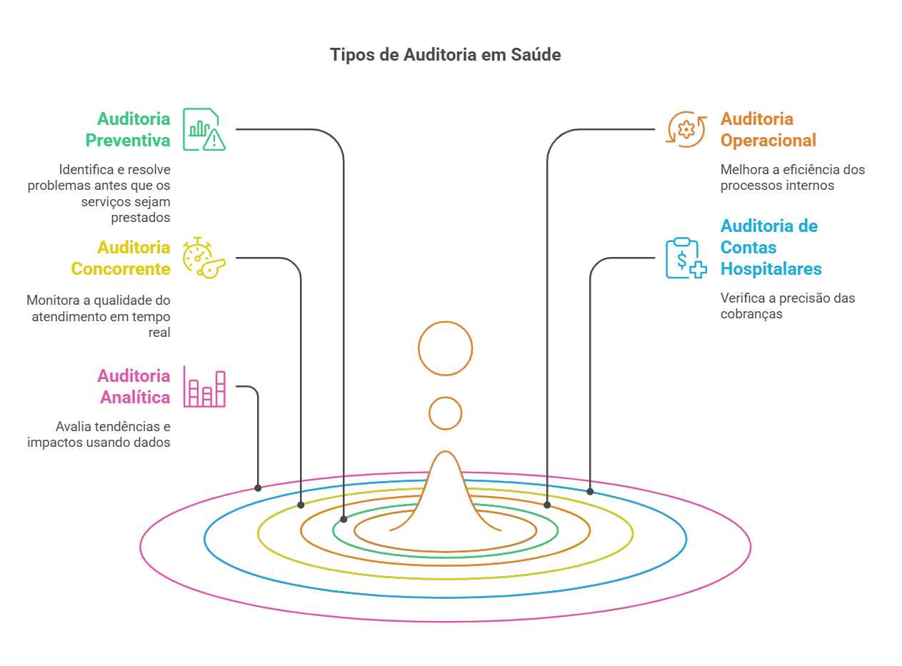

# Controle de Produção e Auditoria  

A **auditoria em saúde** é essencial para garantir a **qualidade, transparência e eficiência** dos serviços prestados. Esse processo avalia se os procedimentos seguem as **normas e regulamentações**, ajudando a prevenir **erros, desperdícios e fraudes**.  

<figure markdown>
  { width="800" }
  <figcaption>Auditoria no SUS. Elaboração própria.</figcaption>
</figure>

---

## O que é Auditoria em Saúde?  

A auditoria em saúde **avalia e monitora** os processos hospitalares, garantindo que estejam de acordo com os padrões exigidos pelo **SUS** e demais órgãos reguladores.  

✅ **Objetivos:**  

- Melhorar a qualidade dos serviços prestados.  
- Reduzir desperdícios e otimizar custos hospitalares.  
- Identificar falhas e oportunidades de melhoria.  
- Garantir conformidade com **normas e regulamentos**.  

✅ **Execução:**  

- **Interna** → Feita pela própria instituição de saúde.  
- **Externa** → Conduzida por órgãos fiscalizadores ou consultorias independentes.  

!!! tip "Dica"
    Auditorias **não devem ser encaradas como punição**, mas como uma ferramenta estratégica para melhorar a gestão hospitalar.

---

## Tipos de Auditoria

A auditoria pode ser realizada de diversas formas, dependendo do objetivo e momento da aplicação.  

### **Auditoria Preventiva**
📌 **Objetivo:** Identificar falhas antes da prestação do serviço.  
💡 **Exemplo:** Avaliação de um novo fornecedor antes da aquisição de insumos médicos.  

### **Auditoria Operacional**
📌 **Objetivo:** Melhorar eficiência e produtividade hospitalar.  
💡 **Exemplo:** Revisão do fluxo de estoque de medicamentos.  

### **Auditoria Concorrente**
📌 **Objetivo:** Monitoramento em tempo real dos serviços prestados.  
💡 **Exemplo:** Observação do atendimento no pronto-socorro.  

### **Auditoria de Contas Hospitalares**
📌 **Objetivo:** Revisar cobranças e evitar desperdícios financeiros.  
💡 **Exemplo:** Análise detalhada de faturas e AIHs para evitar glosas.  

### **Auditoria Analítica**
📌 **Objetivo:** Utilizar **dados e estatísticas** para prever tendências.  
💡 **Exemplo:** Avaliação do impacto de uma campanha de vacinação.  

---

## Benefícios da Auditoria em Saúde  

- **Qualidade e Segurança** → Identifica falhas e propõe melhorias no atendimento ao paciente.  
- **Redução de Custos** → Evita desperdícios e otimiza o uso dos recursos hospitalares.  
- **Conformidade com Regulamentações** → Garante que a instituição siga as normas do SUS.  
- **Transparência e Prestação de Contas** → Evita fraudes e melhora a governança hospitalar.  

!!! info "Importante"
    A auditoria ajuda **não apenas na gestão financeira**, mas também na **segurança do paciente**.

---

## Desafios na Implementação da Auditoria  

**Resistência dos Colaboradores**  

- Alguns profissionais podem enxergar a auditoria como algo punitivo.  
- **Solução:** Educação e sensibilização para demonstrar os benefícios do processo.  

**Falta de Padronização**  

- A ausência de **protocolos bem definidos** pode gerar inconsistências.  
- **Solução:** Implementar normas e checklists claros para todos os setores.  

**Recursos Limitados**  

- Auditorias exigem **tempo, capacitação e tecnologia**.  
- **Solução:** Uso de **sistemas automatizados** e capacitação da equipe.  

---

## Tecnologia e Inovação na Auditoria: DRG Brasil  

O **DRG (Diagnosis-Related Groups)** é uma ferramenta que **classifica pacientes hospitalizados** de acordo com a **complexidade do caso e recursos utilizados**.  

✅ **Benefícios do DRG:**  

- **Comparação entre hospitais e regiões**, avaliando eficiência e custos.  
- **Identificação de desperdícios** e melhorias no faturamento hospitalar.  
- **Análises preditivas** para otimizar os serviços de saúde.  

!!! success "Dica de Melhoria"
    O uso de **DRG Brasil** pode aumentar a eficiência da auditoria e otimizar os gastos hospitalares.  

---

## Relatórios e Documentação na Auditoria  

✅ **Documentos Essenciais:**  

- **Relatório de Auditoria** → Resumo detalhado das não conformidades e recomendações.  
- **Checklist de Inspeção** → Ferramenta padronizada para avaliar processos hospitalares.  
- **Espelho da AIH** → Documento essencial para auditorias no faturamento do SUS.  

!!! warning "Atenção"
    Documentação incompleta pode comprometer a **eficácia da auditoria** e gerar glosas nos faturamentos.  

---

## Conclusão  

A auditoria em saúde **não é apenas um processo burocrático**: ela é **fundamental para a qualidade assistencial e a eficiência dos hospitais**. Com uma abordagem **tecnológica e estratégica**, as auditorias podem transformar a **gestão hospitalar**, garantindo mais **segurança, economia e transparência**.

