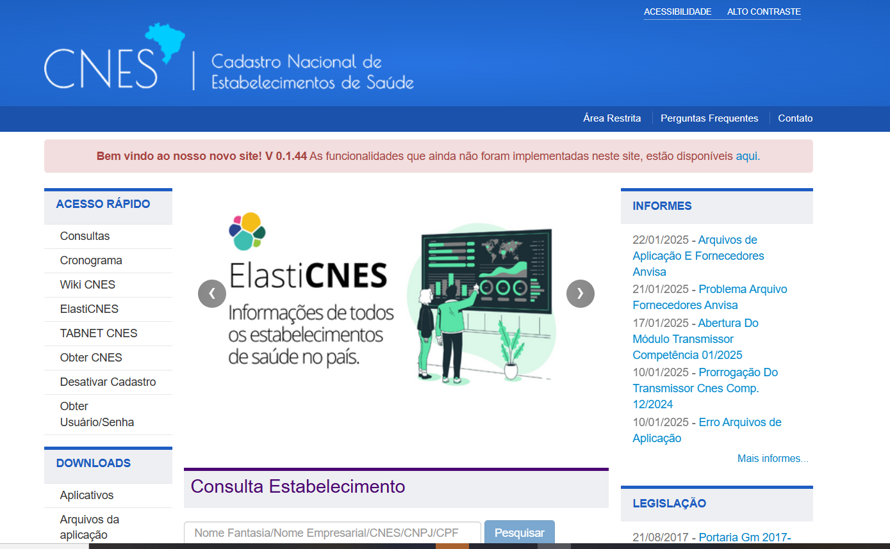

# Cadastro Nacional de Estabelecimentos de Saúde (CNES)

O **Cadastro Nacional de Estabelecimentos de Saúde (CNES)** é o sistema de informação oficial de cadastramento de informações de todos os estabelecimentos de saúde no país, no tocante à realidade da capacidade instalada e mão-de-obra assistencial, independentemente de sua natureza jurídica (públicos ou privados) ou de integrarem o SUS.

Ele é fundamental para que o serviço de saúde realize o faturamento no Sistema Único de Saúde (**SUS**). 

O CNES registra e categoriza os estabelecimentos e profissionais, garantindo a conformidade com as exigências do Ministério da Saúde para o recebimento de repasses e pagamento de procedimentos.

!!! info "Dica Importante"
    O CNES deve ser atualizado regularmente para evitar bloqueios no faturamento.

### Principais requisitos e etapas para o cadastro no CNES com fins de faturamento:
- Identificação do estabelecimento, com informações detalhadas sobre sua localização e estrutura.
- Registro dos profissionais de saúde e sua respectiva classificação de atuação.
- Adequação dos serviços oferecidos às normas estabelecidas pelo Ministério da Saúde.
- Atualização constante das informações no sistema para garantir a validade do cadastro.

<figure markdown>
  { width="800" }
  <figcaption>Informações disponíveis no CNES.</figcaption>
</figure>

<figure markdown>
  { width="600" }
  <figcaption>Página inicial do CNES. Elaboração própria.</figcaption>
</figure>

O CNES é destinado a toda a população brasileira e envolve os seguintes **atores e papéis**:

| **Atores**                  | **Papel** |
|-----------------------------|----------|
| **Estabelecimentos de Saúde** | Registram todos os seus dados, SUS ou não SUS, por meio da aplicação disponibilizada pelo Ministério da Saúde e os enviam periodicamente. |
| **Secretarias de Saúde**      | Acessam os estabelecimentos de saúde do seu território por meio do CNES e são responsáveis pela manutenção dos dados dos estabelecimentos sob a gestão de cada ente federado. |
| **Ministério da Saúde**       | Acessa todos os estabelecimentos de saúde do país no CNES, além de monitorar indicadores de envio de dados por estados, municípios e regiões de saúde. |
| **Cidadãos**                  | Podem consultar os estabelecimentos de saúde através da consulta pública no site do CNES, visualizando os dados públicos por meio de ferramentas como **Tabwin** e **Tabnet**. |

O CNES coleta as seguintes **informações principais**:

- **Dados gerais básicos**
- **Endereço e localização**
- **Gestor responsável** (como secretarias de saúde)
- **Tipos de atendimento** (internações, ambulatórios, etc.)
- **Características do estabelecimento** (tipo, categoria, tributos, etc.)
- **Equipamentos disponíveis** (como RX, tomógrafo, ultrassom, etc.)
- **Serviços de apoio** (como serviços sociais e lavanderias)
- **Especialidades médicas** (como cardiologia e farmácia)
- **Estruturas físicas** (número de leitos, salas, etc.)
- **Profissionais que atuam** (no SUS e fora dele)
- **Equipes de saúde** (como as de saúde da família)
- **Cooperativas**

O cadastro no CNES serve como base para diversos sistemas, incluindo:

- **Sistema de Informação Ambulatorial (SIA/SUS)**
- **Sistema de Informação Hospitalar (SIH/SUS)**
- **Cartão Nacional de Saúde (CNS)**
- **Sistema de Informação de Regulação**
- **Sistema de Informação da Programação Pactuada e Integrada**
- **Sistema de Informações da Anvisa**
- **Sistema de Informações da ANS**
- **Gerenciador de Informações Locais (GIL)**

!!! tip "Importância do CNES"
    É de suma importância que os estabelecimentos de saúde mantenham seus dados no CNES **atualizados** para que os sistemas tenham conhecimento da **capacidade instalada** do local, incluindo estrutura física, habilitações e profissionais e suas especialidades. A falta de registro no CNES da capacidade do estabelecimento pode resultar em **glosas e bloqueios da AIH** (Autorização de Internação Hospitalar).

!!! warning "Atualização obrigatória"
    Os **artigos 371 e 372 da Portaria de Consolidação nº 01/GM/MS/2017** estabelecem que a atualização do cadastro de estabelecimentos de saúde deve ocorrer em meio eletrônico, no mínimo mensalmente, ou sempre que houver alterações nas informações. O CNES permite a atualização diária da base nacional, possibilitando o envio de arquivos da base local para a Base de Dados Nacional do CNES sempre que houver necessidade.

Mesmo quando os dados cadastrais de um estabelecimento de saúde permanecem inalterados em uma competência, recomenda-se o envio mensal. Esse envio será reconhecido como **certidão negativa** e atualizará a data da última atualização nacional. As datas de envio e encerramento de cada competência podem ser consultadas no cronograma disponível no **Portal CNES**, no menu [Acesso Rápido/Cronograma](https://wiki.saude.gov.br/cnes/index.php/Cronograma).

---
### Classificação Brasileira de Ocupações (CBO)
O **CBO** é essencial para definir o papel de cada profissional no estabelecimento. A correspondência entre o **CBO** e os procedimentos que podem ser faturados é verificada automaticamente no sistema.

!!! warning "Obrigatório o cadastro de profissionais adequados"

    Profissionais com especializações específicas são necessários para a autorização de procedimentos de **alta complexidade**.

---

### Cadastro de serviços e habilitações
Para que o estabelecimento possa realizar certos procedimentos de **alta complexidade** ou especializados, ele deve ser **habilitado no CNES**. Exemplos de serviços que exigem habilitação:

- Terapia Intensiva (**UTI**).
- Terapia Nutricional.
- Oncologia.
- Serviços de Hemodiálise.

Cada **habilitação** permite o faturamento de **procedimentos específicos**. O não cumprimento das especificações pode resultar em **rejeição ou glosa**.

---

### Cadastro de leitos
Os leitos devem ser **identificados por tipo**, conforme as diretrizes estabelecidas pelo **Ministério da Saúde**. Exemplos:

- **Enfermaria**.
- **UTI** (Unidade de Terapia Intensiva).
- **UCI Neonatal** (Unidade de Cuidados Intermediários).

A correta categorização desses leitos garante que os pacientes sejam **alocados adequadamente**, conforme suas **necessidades clínicas** e o tipo de atendimento que precisam.

---

### Cadastro de equipamentos e estrutura
Equipamentos de **uso crítico**, como **tomógrafos** e **ultrassonógrafos**, devem estar registrados no **CNES**, especificando:
- **Capacidade**.
- **Compatibilidade com o SUS**.

O uso de **materiais e equipamentos** vinculados a códigos específicos (como **órteses e próteses**) também deve ser compatível com a **Tabela SIGTAP** para fins de faturamento.

---

# SIGTAP

## Classificação e compatibilidades dos procedimentos – SIGTAP
A tabela **SIGTAP** define os procedimentos, materiais e medicamentos que podem ser cobrados, limitando a quantidade e compatibilidade com diagnósticos (**CID**) e condições específicas do paciente. A tabela define os códigos dos procedimentos, materiais e medicamentos utilizados no faturamento.

A **Portaria nº 2.848/2007** regulamenta o uso da SIGTAP, estabelecendo padrões para registros e processamento de informações de internações, incluindo limites de quantidade e faixa etária. Esse controle permite auditorias automáticas que identificam **glosas** e inconsistências.

Nesta seção, serão apresentadas as principais **tabelas e códigos** utilizados no **processo de faturamento** do Sistema Único de Saúde (SUS). O correto entendimento e utilização desses instrumentos são fundamentais para garantir a **precisão e qualidade** das informações registradas, bem como para viabilizar o **pagamento adequado** dos serviços prestados.

As tabelas e códigos desempenham um papel essencial no **registro, processamento e validação** das informações de produção ambulatorial e hospitalar. Elas permitem a padronização dos procedimentos, medicamentos, órteses, próteses e materiais especiais, garantindo que os serviços realizados sejam registrados de forma **uniforme e transparente** em todo o território nacional.

!!! info "Por que as tabelas são essenciais no faturamento?"
    As tabelas e códigos garantem a **uniformidade e padronização** dos registros, permitindo a correta remuneração dos serviços de saúde.
  

## Tabela SIGTAP

<figure markdown>
  { width="800" }
  <figcaption>Página do SIGTAP. Acesso <a href="http://sigtap.datasus.gov.br/tabela-unificada/app/sec/procedimento/publicados/consultar">aqui</a>.</figcaption>
</figure>

O **Sistema de Gerenciamento da Tabela de Procedimentos, Medicamentos, Órteses, Próteses e Materiais Especiais do SUS (SIGTAP)** é um ambiente virtual que permite a **consulta da Tabela de Procedimentos, Medicamentos e OPM** do SUS. Gerenciado pela **CGSI/DRAC/SAS/MS**, o SIGTAP disponibiliza a tabela com todos os seus atributos para os estabelecimentos de saúde credenciados ao SUS.

!!! info "Instituição da tabela de procedimentos"

    A **instituição da Tabela de Procedimentos** foi publicada pela **Portaria GM nº 321, de fevereiro de 2007**, e regulamentada pela **Portaria GM nº 2848, de novembro de 2007**, estando atualmente sob a **Portaria de Consolidação nº 1, de 28 de setembro de 2017**. Este instrumento de gestão possibilita:

    - **Acesso à Tabela de Procedimentos**;
    - **Acompanhamento das alterações** realizadas a cada competência;
    - **Detalhamento das características** dos procedimentos, incluindo compatibilidades e relacionamentos.

#### Características dos Procedimentos no SIGTAP

O SIGTAP fornece informações detalhadas sobre cada procedimento, tais como:

- **Tipo de financiamento**;
- **Instrumento de registro**;
- **Valor**;
- **CBO** (Classificação Brasileira de Ocupações);
- **CID** (Classificação Internacional de Doenças);
- **Serviço/classificação**;
- **Habilitações**;
- **Incrementos financeiros**;
- **Complexidade**.

### Estrutura da Tabela SIGTAP

A **Tabela de Procedimentos do SUS** é organizada em uma estrutura hierárquica, permitindo a consulta dos procedimentos conforme os seguintes elementos:

- **Grupos**;
- **Subgrupos**;
- **Forma de Organização**;
- **Origem**;
- **Documento de publicação**;
- **Competência**.

De acordo com o **DATASUS**:

1. O **Grupo** agrega os **procedimentos, medicamentos e OPMs** conforme a **área de atuação** e a **finalidade** das atividades realizadas.
2. O **Subgrupo** organiza os itens com base no **tipo da área de atuação**.
3. A **Forma de Organização** considera aspectos como **especialidade, tipos de OPM, tipos de exames e tipos de cirurgias**.

Cada procedimento é identificado por um **código específico**, em que:

- Os últimos dígitos correspondem aos **números sequenciais** na forma de organização.
- O **último dígito** representa o **dígito verificador**.

<figure markdown>
  { width="400" }
  <figcaption>Página do WikiSaúde. Acesso <a href="wikisaude.gov.br/sigtap/index/Página_principal">aqui</a>.</figcaption>
</figure>

### Importância do SIGTAP

O SIGTAP é uma ferramenta essencial para o **faturamento do SUS** e para a **auditoria em saúde**, pois traz todas as informações necessárias para o registro padronizado dos procedimentos. Ele organiza e facilita a identificação correta dos itens, garantindo a **transparência**, a **qualidade dos registros** e a **gestão eficiente** dos serviços prestados.

Portanto, ao buscar um procedimento, medicamento ou OPM, o SIGTAP organiza as informações conforme o **grupo, subgrupo e forma de organização**, permitindo uma consulta **precisa e estruturada**.

Veja o exemplo ao buscar o Tratamento de Diabetes Mellitus na tabela: 

<figure markdown>
  { width="800" }
  <figcaption>Descrição Diabete melitus. Acesso <a href="http://sigtap.datasus.gov.br/tabela-unificada/app/sec/procedimento/exibir/0303030038/01/2025">aqui</a>.</figcaption>
</figure>

Confira a codificação na imagem a seguir:

<figure markdown>
  { width="800" }
  <figcaption>Codificação Diabete melitus. Elaboração própria.</figcaption>
</figure>

### Acesso e Funcionalidades do SIGTAP

O sistema **SIGTAP** está disponível em duas versões:

| **Versão** | **Descrição** | **Link** |
|------------|--------------|----------|
| **Web** | Acessível diretamente via internet. | [SIGTAP Web](http://sigtap.datasus.gov.br) |
| **Desktop** | Disponível para download e uso offline. | [Download SIGTAP](http://sigtap.datasus.gov.br/tabela-unificada/app/sec/procedimento/download) |

Para acessar a **versão online**, visite o [site do SIGTAP no DATASUS](http://sigtap.datasus.gov.br) e clique em **“Acessar Tabela Unificada”**.

Para baixar a **versão Desktop**, acesse o mesmo endereço eletrônico e clique em **“Download”** no menu superior direito.

### Funcionalidades da Tabela SIGTAP

A **Tabela do Sistema de Gerenciamento da Tabela de Procedimentos, Medicamentos, Órteses, Próteses e Materiais Especiais do SUS (SIGTAP)** é uma ferramenta que permite:

- **Acessar** a tabela de procedimentos do SUS;
- **Acompanhar** as alterações realizadas em cada recurso;
- **Detalhar** as características, compatibilidade e relação dos procedimentos;
- **Gerar relatórios**;
- **Obter Notas Técnicas** mensais;
- **Importar** a versão da Tabela de Procedimentos para os sistemas de captação e processamento.

!!! note "Atualização dos valores"

    É recorrente a discussão acerca da necessidade de atualização dos valores das tabelas do SIGTAP. A defasagem é de mais de **15 anos**.

No contexto do **faturamento**, além de fornecer dados relativos a cada procedimento, o SIGTAP permite:

- Realizar estudos de **impacto financeiro** decorrentes da unificação das tabelas **SIA e SIH**;
- Gerar **relatórios variados**, adaptados às necessidades do usuário.

### Características Estruturais dos Procedimentos no SIGTAP

Os procedimentos registrados no SIGTAP possuem uma estrutura padronizada, composta pelos seguintes elementos:

**Código**

O **identificador numérico** de **10 dígitos** é gerado a partir da estrutura da tabela de procedimentos, obedecendo o formato: **GR.SB.FO.PPP.D**.

!!! info "Entendendo o código SIGTAP"
    O código **GR.SB.FO.PPP.D** segue esta estrutura:  
    - **GR**: Grupo  
    - **SB**: Subgrupo  
    - **FO**: Forma de Organização  
    - **PPP**: Procedimento específico  
    - **D**: Dígito verificador  

---

**Nome**
Denominação do procedimento.

---

**Descrição**
Definição ou detalhamento das características e orientações de uso do procedimento.

---

**Vigência**
Indica a **competência/mês** de **validade inicial** e **final** do procedimento.

---

**Código de Origem**
Identifica os códigos que deram origem aos procedimentos registrados na tabela SIGTAP. Pode ser dividido em:

- **Origem SIA e SIH**: Procedimentos que deram origem à **Tabela Unificada** instituída em **janeiro/2008**.
- **Origem SIGTAP**: Códigos de 10 dígitos que originam novos procedimentos na tabela SIGTAP.

**Modalidade de Atendimento**

Especifica o **regime de atendimento** no qual o procedimento pode ser realizado. 

As modalidades de atendimento no SIGTAP incluem **códigos, nomes** e suas respectivas **vigências inicial e final**.

| **Código** | **Nome**               | **Vigência inicial** | **Vigência final**       |
|:----------:|:----------------------:|:--------------------:|:------------------------:|
| 1          | Ambulatorial           | jan/08               |                     -    |
| 2          | Hospitalar             | jan/08               |                     -    |
| 3          | Hospital Dia           | jan/08               |                     -    |
| 4          | Internação Domiciliar  | jan/08               | jun/12                   |
| 5          | Assistência Domiciliar | jan/08               | mar/12                   |
| 6          | Atenção Domiciliar     | abr/12               |                     -    |

#### **Complexidade**
Identifica o nível de atenção à saúde no qual é possível a realização do procedimento. Em cada nível estão ações e serviços cuja prática clínica demande:
- Disponibilidade de profissionais especializados.
- Recursos tecnológicos de apoio diagnóstico e terapêutico, organizados em redes regionalizadas.
- Base em dados epidemiológicos, métodos e técnicas.
- Exigência de alta tecnologia e/ou alto custo.

---

#### **Classificação Brasileira de Ocupações (CBO)**

O **CBO** é obrigatório para especificar os **profissionais habilitados** a realizar procedimentos. Desde a implementação do **CNES** em 2003, o **CBO** tem sido usado para categorizar as ocupações dos profissionais nos estabelecimentos de saúde, sendo admitido pelo **Ministério do Trabalho e Emprego**.

> O **CBO reflete a ocupação do profissional no estabelecimento de saúde**, mas **não é sinônimo de especialidade**.  
Para **procedimentos de alta complexidade**, é necessário que o **médico seja especialista**. O sistema **SIH/SUS rejeitará registros** se o CBO informado **não corresponder ao que requer a SIGTAP**. Portanto, o profissional deve estar **cadastrado corretamente no CNES** para garantir a aprovação dos procedimentos.

Corresponde aos códigos da classificação das ocupações do mercado de trabalho, especificando os profissionais de saúde que poderão realizar o procedimento.

---

#### **Instrumentos de Registro**
Identifica o instrumento de captação de dados dos atendimentos:

| **Instrumento** | **Descrição** |
|-----------------|--------------|
| **Boletim de Produção Ambulatorial Consolidado (BPA-C)** | Registro de procedimentos de forma agregada, sem necessidade de autorização. |
| **Boletim de Produção Ambulatorial Individualizado (BPA-I)** | Registro individualizado de procedimentos, com identificação do paciente e CID. Autorização depende do gestor. |
| **Autorização de Procedimento Ambulatorial - APAC (proc. principal)** | Registro de procedimentos individuais que necessitam de autorização prévia. Utilizado para tratamentos contínuos e políticas específicas. |
| **APAC (proc. secundário)** | Registro de procedimentos sem necessidade de autorização prévia, mas dependentes de um procedimento principal. |
| **Autorização de Internação Hospitalar - AIH (proc. principal)** | Registro de procedimentos hospitalares com necessidade de autorização e emissão de AIH. |
| **Autorização de Internação Hospitalar - AIH (proc. especial)** | Registro de procedimentos hospitalares que necessitam de autorização, mas não geram AIH. |
| **Autorização de Internação Hospitalar - AIH (proc. secundário)** | Registro de procedimentos hospitalares que não necessitam de autorização e não geram AIH. |
| **Registro das Ações Ambulatoriais de Saúde (RAAS)** | Instrumento para monitoramento de ações e serviços de saúde em redes assistenciais. |
| **RAAS (Atenção Domiciliar)** | Registro de ações de atenção domiciliar (descontinuado pela PT GM 1653/2015). |
| **RAAS (Atenção Psicossocial)** | Registro de ações de atenção psicossocial (instituído pela PT SAS 854/2012). |

---

#### **Média de Permanência**
Quantidade média de dias de internação prevista para o procedimento, definida com base na prática clínica vigente e na média histórica de produção. Aplica-se apenas a procedimentos principais na modalidade hospitalar.

---

#### **Quantidade de Pontos**
Pontuação definida para o componente "Serviços Profissionais" (SP) nos procedimentos principais e especiais realizados na assistência hospitalar. Visa subsidiar o cálculo do valor a ser rateado entre os profissionais envolvidos.

---

#### **Quantidade Máxima**
Limite máximo permitido por procedimento:
- Para procedimentos com permanência por dia, a quantidade máxima define o número de dias de internação numa mesma AIH.
- Para Órteses, Próteses e Materiais Especiais, a quantidade máxima depende da compatibilidade com o procedimento principal ou especial.

---

#### **Valor**
Valor de referência nacional definido pelo Ministério da Saúde para remuneração do procedimento:

| **Categoria**                   | **Descrição** |
|----------------------------------|--------------|
| **Serviços Hospitalares (SH)**   | Custos hospitalares como diárias, taxas, materiais, medicamentos e SADT. |
| **Serviço Profissional (SP)**    | Atos profissionais (médicos ou cirurgiões-dentistas). Inclui anestesia, quando aplicável. |

---

#### **Serviço/Classificação**
Identifica os serviços especializados necessários para a realização de um procedimento. Apenas estabelecimentos com o serviço/classificação cadastrado no Sistema do CNES podem realizá-lo.

---

#### **Habilitação**
Refere-se à tabela de habilitações do Ministério da Saúde (SCNES), indicando que o estabelecimento possui condições técnicas e operacionais para a assistência. As habilitações são concedidas por portarias ministeriais ou gestores estaduais/municipais.

---

#### **Tipo de Leito**
Indica o tipo de leito necessário para o procedimento. Apenas estabelecimentos com tal leito cadastrado no SCNES podem realizar o procedimento.

---

#### **Idade**

**Idade Mínima:** define em anos completos, a idade mínima permitida para a realização do procedimento especificado, exceto no caso de menores de um ano a idade é definida em dias e meses.

**Idade Máxima:** define em anos completos, a idade máxima permitida para a realização do procedimento especificado, exceto no caso de menores de um ano a idade é definida em dias e meses.
A idade varia em anos de vida de 00 anos a 130 anos

---

#### **Sexo**
É o gênero do usuário que possibilita que o mesmo seja submetido à realização do procedimento. A seleção **"Não se aplica"** significa que o procedimento não tem vinculação com o gênero do usuário.

---

#### **CID Principal**
É o código da Classificação Internacional de Doenças que identifica a patologia/lesão que motivou especificamente o atendimento ambulatorial ou internação do paciente. Utiliza o código da Classificação Estatística Internacional de Doenças e Problemas Relacionados à Saúde - **CID 10**.

---

#### **CID Secundário**
É o código da Classificação Internacional de Doenças que identifica a patologia que iniciou a cadeia de acontecimentos que conduziram diretamente à doença/lesão de base ou que foram desencadeados durante a internação. Utiliza o código da Classificação Estatística Internacional de Doenças e Problemas Relacionados à Saúde - **CID 10**.

---

#### **Tipo de Financiamento**
É o tipo de financiamento do procedimento em coerência aos blocos de financiamento definidos no **Pacto de Gestão**. Os tipos de financiamento são:

| **Código** | **Tipo de Financiamento** |
|:----------:|--------------------------|
| **01**     | Piso de Atenção Básica (PAB) |
| **02**     | Assistência de Média e Alta Complexidade (MAC) |
| **04**     | Fundo de Ações Estratégicas e Compensação (FAEC) |
| **05**     | Incentivo MAC |
| **06**     | Assistência Farmacêutica |
| **07**     | Vigilância em Saúde |
| **08**     | Gestão do SUS |

---

#### **Subtipo de Financiamento**
O tipo de financiamento **04 - Fundo de Ações Estratégicas e Compensação (FAEC)** tem uma tabela derivada chamada **Subtipo de Financiamento**. Esta tabela apresenta:

- **Código:** Identificação única do subtipo.
- **Nome:** Nome do subtipo de financiamento.
- **Vigência inicial:** Data inicial da validade.
- **Vigência final:** Data final da validade (se aplicável).
- **Portaria/Documento que inclui:** Normativo que instituiu o subtipo.
- **Portaria/Documento que encerra:** Normativo que descontinuou o uso do subtipo (se aplicável).

| **CÓDIGO** | **NOME**                                                                                         | **VIGÊNCIA INICIAL** | **VIGÊNCIA FINAL**                                   | **PORTARIA/DOCUMENTO QUE INCLUI**                  | **PORTARIA/DOCUMENTO QUE ENCERRA**                 |
|------------|--------------------------------------------------------------------------------------------------|----------------------|-----------------------------------------------------|---------------------------------------------------|---------------------------------------------------|
| 040001     | Coleta de material                                                                               | jan/08               | nov/08                                              | Portaria GM/MS 2848 de 06/11/2007                 | Portaria GM/MS 2867 de 27/11/2008                 |
| 040002     | Diagnóstico em laboratório clínico                                                               | jan/08               | jan/08 a nov/08 e jan/2013 até nov/2017            | Portaria GM/MS 2848 de 06/11/2007                 | Portaria GM/MS 2867 de 27/11/2008 e Portaria GM/MS 3011 de 10/11/2017 |
| 040003     | Coleta/exame anátomo-patológico colo uterino                                                     | jan/08               | nov/08                                              | Portaria GM/MS 2848 de 06/11/2007                 | Portaria SAS/MS 312 de 11/06/2008                 |
| 040004     | Diagnóstico em neurologia                                                                        | jan/08               | out/08                                              | Portaria GM/MS 2848 de 06/11/2007                 | Portaria GM/MS 2867 de 27/11/2008                 |
| 040005     | Diagnóstico em otorrinolaringologia/fonoaudiologia                                               | jan/08               | nov/08                                              | Portaria GM/MS 2848 de 06/11/2007                 | Portaria GM/MS 2867 de 27/11/2008                 |
| 040006     | Diagnóstico em psicologia/psiquiatria                                                            | jan/08               | out/08                                              | Portaria GM/MS 2848 de 06/11/2007                 | Portaria GM/MS 2867 de 27/11/2008                 |
| 040007     | Consultas médicas/outros profissionais de nível superior                                         | jan/08               | nov/17                                              | Portaria GM/MS 2848 de 06/11/2007                 | Portaria GM/MS 3011 de 10/11/2017                 |
| 040008     | Atenção domiciliar                                                                               | jan/08               | nov/08                                              | Portaria GM/MS 2848 de 06/11/2007                 | Portaria GM/MS 2867 de 27/11/2008                 |
| 040009     | Atendimento/acompanhamento em reabilitação física, mental, visual, auditiva e múltiplas deficiências | jan/08               |                                                     | Portaria GM/MS 2848 de 06/11/2007                 |                                                   |
| 040010     | Atendimento/acompanhamento psicossocial                                                          | jan/08               | nov/08                                              | Portaria GM/MS 2848 de 06/11/2007                 | Portaria GM/MS 2867 de 27/11/2008                 |
| 040011     | Atendimento/acompanhamento em saúde do idoso                                                     | jan/08               | nov/08                                              | Portaria GM/MS 2848 de 06/11/2007                 | Portaria GM/MS 2867 de 27/11/2008                 |
| 040012     | Atendimento/acompanhamento de queimados                                                          | jan/08               | nov/08                                              | Portaria GM/MS 2848 de 06/11/2007                 | Portaria GM/MS 2867 de 27/11/2008                 |
| 040013     | Atendimento/acompanhamento de diagnóstico de doenças endocrinas/metabólicas e nutricionais       | jan/08               |                                                     | Portaria GM/MS 2848 de 06/11/2007                 |                                                   |
| 040014     | Tratamento de doenças do sistema nervoso central e periférico                                    | jan/08               | jan/08 a nov/08 e mai/11 até nov/17                | Portaria GM/MS 2848 de 06/11/2007                 | Portaria GM/MS 3011 de 10/11/2017                 |
| 040015     | Tratamento de doenças do aparelho da visão                                                      | jan/08               | nov/17                                              | Portaria GM/MS 3011 de 10/11/2017                 | Portaria GM/MS 3011 de 10/11/2017                 |
| 040016     | Tratamento em oncologia                                                                          | jan/08               | nov/17                                              | Portaria GM/MS 2848 de 06/11/2007                 | Portaria GM/MS 3011 de 10/11/2017                 |
| 040017     | Nefrologia                                                                                       | jan/08               |                                                     | Portaria GM/MS 2848 de 06/11/2007                 |                                                   |
| 040018     | Tratamentos odontológicos                                                                        | jan/08               | nov/17                                              | Portaria GM/MS 2848 de 06/11/2007                 | Portaria GM/MS 3011 de 10/11/2017                 |
| 040019     | Cirurgia do sistema nervoso central e periférico                                                 | jan/08               | out/08                                              | Portaria GM/MS 2848 de 06/11/2007                 | Portaria GM/MS 2867 de 27/11/2008                 |
| 040020     | Cirurgias de ouvido, nariz e garganta                                                            | jan/08               | out/08                                              | Portaria GM/MS 2848 de 06/11/2007                 | Portaria GM/MS 2867 de 27/11/2008                 |
| 040021     | Deformidade lábio-palatal e crânio-facial                                                        | jan/08               | nov/08                                              | Portaria GM/MS 2848 de 06/11/2007                 | Portaria GM/MS 2867 de 27/11/2008                 |
| 040022     | Cirurgia do aparelho da visão                                                                    | jan/08               | out/08                                              | Portaria GM/MS 2848 de 06/11/2007                 | Portaria GM/MS 2867 de 27/11/2008                 |
| 040023     | Cirurgia do aparelho circulatório                                                                | jan/08               | nov/17                                              | Portaria GM/MS 2848 de 06/11/2007                 | Portaria GM/MS 3011 de 10/11/2017                 |
| 040024     | Cirurgia do aparelho digestivo, órgãos anexos e parede abdominal (inclui pré e pós-operatório)   | jan/08               |                                                     | Portaria GM/MS 2848 de 06/11/2007                 |                                                   |
| 040025     | Cirurgia do aparelho geniturinário                                                               | jan/08               | nov/08                                              | Portaria GM/MS 2848 de 06/11/2007                 | Portaria GM/MS 2867 de 27/11/2008                 |
| 040026     | Tratamento de queimados                                                                          | jan/08               | nov/08                                              | Portaria GM/MS 2848 de 06/11/2007                 | Portaria GM/MS 2867 de 27/11/2008                 |
| 040027     | Cirurgia reparadora para lipodistrofia                                                           | jan/08               | nov/08                                              | Portaria GM/MS 2848 de 06/11/2007                 | Portaria GM/MS 2867 de 27/11/2008                 |
| 040028     | Outras cirurgias plásticas/reparadoras                                                           | jan/08               |                                                     | Portaria GM/MS 2848 de 06/11/2007                 |                                                   |
| 040029     | Cirurgia orofacial                                                                               | jan/08               | nov/17                                              | Portaria GM/MS 2848 de 06/11/2007                 | Portaria GM/MS 3011 de 10/11/2017                 |
| 040030     | Sequenciais                                                                                      | jan/08               |                                                     | Portaria GM/MS 2848 de 06/11/2007                 |                                                   |
| 040032     | Transplantes de órgãos, tecidos e células                                                       | jan/08               |                                                     | Portaria GM/MS 2848 de 06/11/2007                 |                                                   |
| 040033     | Medicamentos para transplante                                                                    | jan/08               |                                                     | Portaria GM/MS 2848 de 06/11/2007                 |                                                   |
| 040035     | OPM em odontologia                                                                               | jan/08               | nov/17                                              | Portaria GM/MS 2848 de 06/11/2007                 | Portaria GM/MS 3011 de 10/11/2017                 |
| 040036     | OPM em queimados                                                                                 | jan/08               | out/08                                              | Portaria GM/MS 2848 de 06/11/2007                 | Portaria GM/MS 2867 de 27/11/2008                 |
| 040038     | OPM para transplantes                                                                            | jan/08               |                                                     | Portaria GM/MS 2848 de 06/11/2007                 |                                                   |
| 040039     | Incentivos ao pré-natal e nascimento                                                             | jan/08               | out/08                                              | Portaria GM/MS 2848 de 06/11/2007                 | Portaria GM/MS 2867 de 27/11/2008                 |
| 040040     | Incentivo ao registro civil de nascimento                                                        | jan/08               | out/08                                              | Portaria GM/MS 2848 de 06/11/2007                 | Portaria GM/MS 2867 de 27/11/2008                 |
| 040041     | Central Nacional de Regulação de Alta Complexidade (CNRAC)                                       | jan/08               | jan/08                                              | Portaria GM/MS 2848 de 06/11/2007                 |                                                   |
| 040042     | Reguladores de Atividade Hormonal - Inibidores de Prolactina                                     | jan/08               | out/08                                              | Portaria GM/MS 2848 de 06/11/2007                 | Portaria GM/MS 2867 de 27/11/2008                 |
| 040043     | Política Nacional de Cirurgias Eletivas                                                          | jan/08               | jan/08                                              | Portaria GM/MS 2848 de 06/11/2007                 |                                                   |
| 040044     | Redesignação e Acompanhamento                                                                    | jan/08               |                                                     | Portaria GM/MS 2848 de 06/11/2007                 |                                                   |
| 040045     | Projeto Olhar Brasil                                                                             | mai/09               | ago/10                                              | Portaria SAS/MS 143 de 14/05/2009                 | Portaria SAS/MS 435 de 10/09/2010                 |
| 040046     | Mamografia para Rastreamento                                                                     | jul/09               | dez/13                                              | Portaria GM/MS 1183 de 03/06/2009                 | Portaria SAS/MS 1253 de 12/11/2013                 |
| 040047     | Projeto Olhar Brasil - Consulta                                                                  | set/10               | dez/16                                              | Portaria SAS/MS 435 de 10/09/2010                 | Portaria SAS/MS 1660 de 17/11/2016                 |
| 040048     | Projeto Olhar Brasil - Óculos                                                                    | set/10               | dez/16                                              | Portaria SAS/MS 435 de 10/09/2010                 | Portaria SAS/MS 1660 de 17/11/2016                 |
| 040049     | Implementar Cirurgias CV Pediátrica                                                              | ago/17               |                                                     | Portaria SAS/MS 1197 de 11/07/2017                 |                                                   |
| 040050     | Cirurgias Eletivas - Componente I                                                                | out/11               | out/11                                              | não existe                                        |                                                   |
| 040051     | Cirurgias Eletivas - Componente II                                                               | out/11               | out/11                                              | não existe                                        |                                                   |
| 040052     | Cirurgias Eletivas - Componente III                                                              | out/11               | out/11                                              | não existe                                        |                                                   |
| 040053     | Prótese Mamária - Exames                                                                         | fev/12               | dez/16                                              | Portaria GM/MS 196 de 06/02/2012                 | Portaria GM/MS 2580 de 30/11/2016                 |
| 040054     | Prótese Mamária - Cirurgia                                                                       | fev/12               | nov/17                                              | Portaria GM/MS 196 de 06/02/2012                 | Portaria GM/MS 3011 de 10/11/2017                 |
| 040055     | Transplante - Histocompatibilidade                                                               | jan/13               |                                                     | Portaria GM/MS 844 de 02/05/2012                 |                                                   |
| 040056     | Triagem Neonatal                                                                                 | jan/13               | nov/17                                              | Portaria SAS/MS 1434 de 19/12/2012               | Portaria GM/MS 3011 de 10/11/2017                 |
| 040057     | Controle de qualidade do exame citopatológico do colo de útero                                   | out/13               | dez/17                                              | Portaria GM/MS 1504 de 23/07/2013                 | Portaria GM/MS 15 de 03/01/2018                   |
| 040058     | Exames do Leite Materno                                                                          | mai/13               | nov/17                                              | Portaria GM/MS 961 de 22/05/2013                 | Portaria GM/MS 3011 de 10/11/2017                 |
| 040059     | Atenção às Pessoas em Situação de Violência Sexual                                               | dez/14               | nov/17                                              | Portaria GM/MS 2415 de 07/11/2014                | Portaria GM/MS 3011 de 10/11/2017                 |
| 040060     | Sangue e Hemoderivados                                                                           | nov/14               | nov/17                                              | Portaria GM/MS 2265 de 16/10/2014                | Portaria GM/MS 3011 de 10/11/2017                 |
| 040061     | Mamografia para rastreamento em faixa etária recomendada                                         | jan/14               | jan/14                                              | não existe                                        |                                                   |
| 040062     | Doenças Raras                                                                                    | mar/14               |                                                     | Portaria GM/MS 199 de 30/01/2014                 |                                                   |
| 040063     | Cadeiras de Rodas                                                                                | jun/14               |                                                     | Memorando 212/2014 de 23/05/2014                |                                                   |
| 040064     | Sistema de Frequência Modulada Pessoal-FM                                                        | jun/14               | nov/17                                              | Memorando 212/2014 de 23/05/2014                | Portaria GM/MS 3011 de 10/11/2017                 |
| 040065     | Medicamentos em Urgência                                                                         | jan/15               |                                                     | Portaria GM/MS 2777 de 18/12/2014               |                                                   |
| 040066     | Cirurgias Eletivas - Componente Único                                                            | ago/15               | ago/15                                              | não existe                                        |                                                   |
| 040067     | Atenção Especializada em Saúde Auditiva                                                          | jul/16               |                                                     | Nota Técnica 07/2016 de 25/06/2016               |                                                   |
| 040068     | Terapias Especializadas em Angiologia                                                            | mar/17               |                                                     | Portaria GM/MS 709 de 09/03/2017                 |                                                   |
| 040069     | Tratamento de Doença Macular                                                                     | jan/19               |                                                     | Portaria GM/MS 4225 de 26/12/2018               |                                                   |

---

#### **Incremento**
É um percentual que é acrescido ao valor do procedimento e está vinculado diretamente a uma habilitação do estabelecimento.

---

#### **Regra Condicionada**
É uma regra que será aplicada ao procedimento para registro e/ou processamento e/ou financiamento no **Sistema de Informações Hospitalar (SIH/SUS)** e no **Sistema de Informação Ambulatorial (SIA/SUS)**.

As regras condicionadas presentes no **SIGTAP** estão na tabela a seguir com:
- **Código/Nome**
- **Descrição**
- **Vigências Inicial e Final**
- **Portaria/Documento Relacionado à Inclusão/Encerramento**

!!! danger "Regras que podem levar a glosas"
    Algumas regras condicionadas resultam na **rejeição automática de AIH/APAC**, caso os critérios não sejam atendidos.

| **CÓDIGO/NOME**                                  | **DESCRIÇÃO**                                                                                                                                                                          | **VIGÊNCIA INICIAL/FINAL**        | **PORTARIA/DOCUMENTO RELACIONADO À INCLUSÃO/ENCERRAMENTO**          |
|--------------------------------------------------|---------------------------------------------------------------------------------------------------------------------------------------------------------------------------------------|-----------------------------------|----------------------------------------------------------------------|
| 001 Condiciona registro em BPA-I (CEO e PCD)     | Atendimento odontológico à pessoa com deficiência (PCD) realizado em centro de especialidades odontológicas (CEO) habilitados (0403,0404 ou 0405) deverá ser registrado em BPA-I com preenchimento do campo serviço 114 classificação 007 | Inicial 11/2012                  | Portaria SAS 911 de 29/08/2012                                      |
| 002 Condiciona o tipo de financiamento por FAEC (POB) | Procedimento oftalmológico quando realizado em estabelecimento habilitado em projeto olhar brasil (05.05) e apresentado exclusivamente nos serviços 131/006 ou 131/007, o tipo de financiamento será FAEC e aplica-se incremento | Inicial 01/2013 / Final 07/2017 | Portaria SAS 1229 de 20/12/2012 / Portaria SAS 1660 de 17/11/2016   |
| 003 Condiciona a rejeição da AIH - oncologia     | Caso haja duplicidade de AIH na mesma competência de processamento no SIHD e um dos procedimentos principais for o de código 0415020050 procedimentos sequenciais em oncologia, a AIH com data de alta mais recente será a única aprovada. | Inicial 01/2013                  | Portaria GM 2947 de 24/12/2012                                      |
| 004 Condiciona incremento por CID exclusivos     | Quando os procedimentos de códigos (02.09.01.003-7, 02.05.02.004-6, 02.05.01.003-2, 02.05.01.004-0 e 02.11.08.005-5) forem registrados com os CID e66.0, e66.2, e66.8 e e66.9, na modalidade ambulatorial e o estabelecimento de saúde possuir habilitação 02.03, o tipo de financiamento passa a ser FAEC com o subtipo de financiamento 0024 | Inicial 04/2013                  | Portaria GM 425 de 19/03/2013                                       |
| 005 Financiamento por faixa etária - mamografia  | Procedimento 02.04.03.018-8 mamografia bilateral para rastreamento quando realizado em pessoa com idade compreendida entre 50 a 69 anos, o tipo de financiamento será FAEC.            | Inicial 12/2013 / Final 12/2017 | Portaria SAS 1253 de 12/11/2013 / Portaria GM 15 de 03/01/2018      |
| 006 Condiciona a rejeição da AIH- ortopedia      | Caso haja duplicidade de AIH na mesma competência de processamento no SIHD e um dos procedimentos principais for o de código 04.15.02.006-9 procedimentos sequenciais em ortopedia ou quaisquer outros iniciados por 0408, caberá ao gestor aprovar apenas uma destas AIH. | Inicial 02/2014                  | Portaria SAS 10 de 06/01/2014                                       |
| 007 Condiciona a rejeição da AIH - neurocirurgia | Caso haja duplicidade de AIH na mesma competência de processamento no SIHD e um dos procedimentos principais for o de código 04.15.02.007-7 procedimentos sequenciais em neurocirurgia ou quaisquer outros iniciados por 0403, caberá ao gestor aprovar apenas uma destas AIH. | Inicial 02/2014                  | Portaria SAS 09 de 06/01/2014                                       |
| 008 Condiciona a ter o valor zerado              | Procedimento sem valor quando apresentado como APAC Secundário - valor zerado                                                                                                         | Inicial 03/2014                  | Portaria GM 199 de 30/01/2014                                       |
| 009 Condiciona aos procedimentos secundários a terem o valor zerado | Os procedimentos principais vinculados a esta regra terão seus procedimentos secundários com valor zerado.                                                                              | Inicial 04/2014                  | Portaria GM 389 de 13/03/2014                                       |
| 010 Condiciona financiamento FAEC pela faixa etária e pela habilitação do estabelecimento | O procedimento 02.03.01.008-6, realizado em pessoa com idade compreendida entre 25 a 64 anos e quando realizado em estabelecimento de saúde habilitado (32.02 e 32.03), terá o tipo de financiamento FAEC e sub-tipo de financiamento 040057. | Inicial 09/2014 / Final 01/2019 | Informe CGSI 09/2014 de 08/09/2014 / Portaria GM 15 de 03/01/2018   |

Regras condicionadas. [Fonte aqui.](https://wiki.saude.gov.br/sigtap/index.php/Gerais)

---

# Cartão Nacional de Saúde (CNS)

O [**Cartão Nacional de Saúde (CNS)**](https://www.gov.br/saude/pt-br/acesso-a-informacao/acoes-e-programas/cns) é o documento que **identifica o usuário do SUS**. Ele contém informações como **nome, data de nascimento, telefone, endereço, CPF, RG**, entre outros. O número do CNS funciona como uma **chave de integração** dos sistemas de saúde que precisam identificar pessoas, como pacientes, operadores ou profissionais de saúde. Isso possibilita a criação de um **histórico de atendimentos** de cada pessoa no SUS, permitindo o acesso a dados de sistemas como o de atenção básica, hospitalar e de dispensação de medicamentos, por exemplo.

Os principais **benefícios do CNS** incluem:

- **Identificação rápida do usuário**
- **Acesso ao prontuário** pelo número do cartão
- **Conexão entre profissional, paciente, hospital e atendimento**
- **Registro dos atendimentos, consultas e exames realizados**
- **Controle de medicamentos dispensados**
- **Atualização de dados cadastrais**

O CNS faz parte da política de **e-Saúde do Ministério da Saúde**, que visa organizar e integrar informações sobre pessoas, serviços de saúde e procedimentos. Isso facilita a **gestão do SUS** e o atendimento ao cidadão, além de ajudar os gestores e profissionais da saúde a realizarem um trabalho mais qualificado.

A partir do cadastramento do usuário e da emissão do CNS, com a integração dos sistemas por meio do número do cartão, torna-se possível **identificar o usuário em todos os seus contatos com o SUS** e acompanhar sua evolução dentro do sistema, com efeitos positivos tanto na **atenção individual** quanto no **planejamento das ações de saúde**.

!!! warning "Obrigatoriedade do CNS"
    Conforme a **Portaria Conjunta nº 2, de 15 de março de 2012** do Ministério da Saúde, o preenchimento do número do CNS do usuário é **obrigatório para o registro dos procedimentos ambulatoriais e hospitalares** nos instrumentos de registro das ações de saúde do Ministério da Saúde. O registro do número do CNS deve ser providenciado no ato da admissão do paciente.

Caso o usuário das ações e serviços de saúde não possua cadastro na **Base Nacional de Dados dos Usuários das Ações e Serviços de Saúde**, o estabelecimento de saúde deve realizar o cadastro por meio do aplicativo disponibilizado pelo DATASUS na internet.

O preenchimento do número do CNS é **opcional** nos instrumentos de registro das ações de saúde nos seguintes casos:

1. Para ações de saúde realizadas em **doadores falecidos**, conforme a Lei 9.434, de 04 de fevereiro de 2007.
2. Quando não for possível informar o número do CNS do paciente em atendimentos de **urgência, acidentes no local de trabalho, acidentes no trajeto para o trabalho**, outros tipos de acidentes de trânsito ou **outras lesões e envenenamentos**, conforme descrito na referida portaria.

O estabelecimento e o gestor de saúde devem apresentar **justificativa escrita** nos instrumentos de registro, descrevendo a razão da falta da informação do número do CNS na ação de saúde. As ações de saúde apresentadas sem o número do CNS estarão **bloqueadas nos sistemas de informação** e somente serão desbloqueadas mediante o aceite das justificativas pelas instâncias superiores.

É também **obrigatória a inclusão do número do CNS do profissional solicitante, executante e/ou autorizador** das ações de saúde nos instrumentos de registro, como:

1. **Autorizações de Internação Hospitalar (AIH)**
2. **Autorizações de Procedimentos Ambulatoriais (APAC)**
3. **Boletim de Produção Ambulatorial Individualizada (BPA I)**

# Tasy

A Fundação Hospitalar do Estado de Minas Gerais (Fhemig) está implementando o sistema eletrônico de gestão hospitalar **Philips Tasy**, uma das plataformas mais completas e modernas disponíveis atualmente no mercado. O Tasy é um software abrangente que integra, em uma única solução, processos administrativos, assistenciais e financeiros das unidades hospitalares.

## O que é o Tasy?

O **Tasy** é um sistema eletrônico de gestão hospitalar desenvolvido pela Philips, que unifica e integra diversas áreas administrativas e assistenciais em uma única plataforma. A solução contempla desde o prontuário eletrônico até processos financeiros, permitindo maior controle, eficiência e segurança nas operações hospitalares.

## Principais funcionalidades do sistema

O sistema Tasy oferece diversas funcionalidades importantes para a rotina hospitalar:

- **Prontuário Eletrônico do Paciente:** registro único, integrado e acessível em tempo real.
- **Gestão de pacientes:** histórico clínico completo, medicamentos prescritos, consultas agendadas e tratamentos realizados.
- **Prescrição médica eletrônica:** redução de erros, economia de tempo e integração direta com farmácia hospitalar.
- **Gestão de leitos:** monitoramento em tempo real da ocupação e disponibilidade dos leitos hospitalares.
- **Controle financeiro integrado:** faturamento SUS e convênios, controle de receitas e despesas, geração automatizada de relatórios financeiros.
- **Gerenciamento completo de suprimentos:** controle eficiente das compras, estoque e validade dos produtos.
- **Integração com dispositivos médicos:** comunicação direta com equipamentos médicos para coleta automática de dados clínicos.
- **Relatórios e indicadores gerenciais:** geração automática de relatórios para suporte à tomada de decisões estratégicas.

## Principais benefícios do Tasy para a Fhemig

A implementação do sistema Tasy traz diversos benefícios para as unidades da Fhemig, entre eles:

- ✅ **Prontuário eletrônico integrado:** acesso rápido às informações clínicas dos pacientes, sem necessidade de impressão física.
- ✅ **Redução significativa de processos manuais:** automatização e padronização das rotinas administrativas e assistenciais.
- ✅ **Maior segurança dos dados:** proteção avançada das informações clínicas conforme exigências da Lei Geral de Proteção de Dados (LGPD).
- ✅ **Melhoria na gestão da qualidade assistencial:** por meio da aplicação padronizada de protocolos clínicos atualizados.
- ✅ **Redução do uso de documentos impressos:** economia financeira e sustentabilidade ambiental.
- ✅ **Comunicação mais ágil entre setores:** integração completa das informações clínicas e administrativas em tempo real.

## Acesso aos Manuais do Sistema Tasy

Para facilitar a utilização correta do sistema pelas equipes das unidades da Fhemig, estão disponíveis manuais completos com orientações detalhadas sobre o uso do sistema. Estes materiais incluem instruções práticas sobre acesso ao sistema, cadastro correto das informações assistenciais e administrativas, prescrição eletrônica, solicitação de exames e muito mais.

📚 [**Acesse aqui os manuais completos do Sistema Tasy (disponível somente via intranet da Fhemig)**](http://10.49.10.204/index.php/menu/sistemas/tasy/tasy-manuais-operacioanais)
