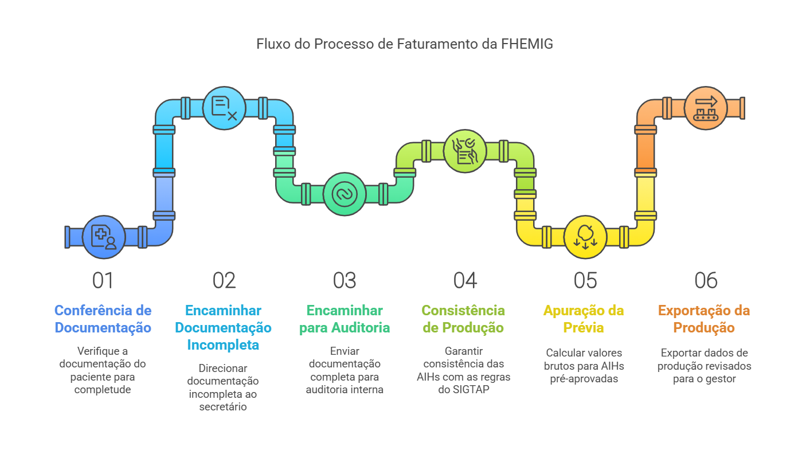

# Fluxo do Faturamento no SUS

## O processo de faturamento no Sistema Único de Saúde (SUS)
O processo de faturamento no Sistema Único de Saúde (SUS) envolve várias etapas desde a entrada do paciente até o fechamento do prontuário. Esse processo é importante para que os serviços prestados possam ser registrados e cobrados adequadamente.

<figure markdown>
  { width="800" }
  <figcaption>Fluxo do faturamento. Elaboração própria.</figcaption>
</figure>

---

## Forma de acesso dos usuários às unidades da FHEMIG
O acesso dos pacientes às unidades da FHEMIG ocorre das seguintes formas:

| **Forma de Acesso** | **Descrição** |
|----------------------|--------------|
| **Referenciada** | Encaminhamento de UBS, UPAs ou outras unidades para atendimentos especializados. |
| **Urgência e Emergência** | Atendimento direto em pronto-socorro, com triagem baseada na classificação de risco. |

---

!!! question "Como um paciente pode ser internado?"
    O encaminhamento pode ocorrer de diversas formas:
    
    - **🚑 Emergência:** Paciente atendido no pronto-socorro, que necessita de internação imediata.
    - **🏥 Ambulatório:** Após consulta em um serviço especializado.
    - **🔄 Referência externa:** Encaminhamento de outro hospital ou posto de saúde.
    - **📅 Internação eletiva:** Programada para cirurgias ou tratamentos específicos.

---

## Caráter de atendimento
Refere-se ao tipo de internação e à urgência da condição do paciente, podendo incluir as seguintes classificações principais:

| **Código** | **Caráter de Atendimento** |
|:----------:|---------------------------|
| **01**     | Eletivo - Internação programada sem urgência. |
| **02**     | Urgência - Atendimento emergencial. |
| **03**     | Acidente de Trabalho - Internação decorrente de acidente laboral. |
| **04**     | Acidente de Trajeto - Ocorrido no deslocamento para o trabalho. |
| **05**     | Acidente de Trânsito - Fora do contexto de trabalho. |
| **06**     | Lesões ou Envenenamento - Por agentes químicos ou físicos. |

---

## Regulação do acesso
O hospital cadastra a solicitação de internação ou transferência no sistema **SUSfácilMG**. Esse sistema informatizado permite o cadastro e acompanhamento das solicitações, facilitando a comunicação entre as unidades de saúde e as centrais de regulação.

**🖥️ SUSfácil MG**  
📌 Sistema que gerencia solicitações de internação e transferência.

**🏥 Núcleo Interno de Regulação (NIR)**  
📌 Responsável pela movimentação interna dos pacientes dentro dos hospitais, garantindo a otimização dos recursos.

---

## Laudo para solicitação de AIH
O laudo é o documento necessário para solicitar a autorização de internação do paciente no SUS. Sua emissão é uma responsabilidade restrita a médicos, cirurgiões-dentistas e enfermeiros obstetras, conforme suas respectivas áreas de atuação.

!!! example "Modelo de Laudo AIH"
    O laudo deve conter:
    
    - 📌 **Nome e CNS do paciente**
    - 📌 **Motivo da internação**
    - 📌 **Diagnóstico inicial**
    
    🔗 Acesse o [modelo de laudo AIH aqui](https://www.uberaba.mg.gov.br/portal/acervo/saude/arquivos/centralderegulacao/ModeloLaudoAIH.pdf)

---

## Envio da solicitação
A solicitação de internação pode ser encaminhada via Central de Regulação de Leitos da Secretaria Municipal de Saúde (SMS), que gerencia a alocação de leitos na rede pública. Isso pode ser feito via sistema informatizado ou comunicação direta entre a unidade e a central.

!!! info "O papel da Central de Regulação de Leitos"
    A Central de Regulação de Leitos analisa solicitações de internação **com base na urgência e disponibilidade**. Se aprovado, o hospital é designado para o atendimento.

---

## Autorização de Internação Hospitalar (AIH)
É um documento essencial no (SUS) para formalizar a internação de um paciente. A AIH é emitida para registrar, autorizar e financiar a internação hospitalar e o tratamento associado, incluindo procedimentos e medicamentos necessários ao cuidado do paciente.

### Dados pessoais e administrativos
| **Dado** | **Descrição** |
|----------|--------------|
| **Nome do Paciente** | Identificação completa do paciente. |
| **Data de Nascimento** | Idade e cálculo de elegibilidade. |
| **Número do CNS** | Vinculação ao SUS. |
| **Diagnóstico Inicial** | Razão da internação. |
| **Código da AIH** | Número único para registro e faturamento. |

### Informações clínicas de admissão
- Diagnóstico inicial e motivo da internação.
- Histórico clínico e antecedentes relevantes, como condições crônicas e alergias.
- Laudo médico que justifica a internação, contendo sinais, sintomas e possíveis diagnósticos diferenciais.

---

### Registro da assistência prestada ao paciente

### 🏥 Registros Essenciais
📌 **Exames e procedimentos:** Testes laboratoriais, cirurgias e tratamentos.  
📌 **Evolução clínica:** Progresso do paciente, resposta ao tratamento.  
📌 **Prescrição médica:** Medicamentos administrados, dosagem e horário.  
📌 **Acompanhamento multiprofissional:** Fisioterapeutas, enfermeiros, psicólogos.  

Essas informações registradas no prontuário são essenciais para garantir a qualidade do atendimento, a segurança do paciente e a transparência administrativa, além de viabilizar a comunicação entre os profissionais de saúde envolvidos.

---

### Numeração de AIH
- **Geração do número da AIH:** Após a aprovação, a Central de Regulação gera o número da AIH, único para cada internação. Esse número identifica oficialmente o atendimento no sistema SUS e permite o controle e o faturamento dos serviços prestados.
- **Envio à unidade:** O número da AIH é enviado à unidade, que o registra no prontuário do paciente. Esse número é essencial para documentar todo o atendimento, desde a admissão até a alta, e para o faturamento junto ao SUS.
- **Acompanhamento do status:** A unidade pode acompanhar o status da solicitação e a numeração da AIH por meio dos sistemas de regulação de saúde estadual ou municipal, integrados ao sistema nacional do SUS.

**📌 Etapas do Número AIH**

1️⃣ **Solicitação da AIH** pelo hospital.  
2️⃣ **Análise da Central de Regulação**.  
3️⃣ **Geração do número AIH** e envio ao hospital.  
4️⃣ **Registro no prontuário do paciente**.  
5️⃣ **Monitoramento da internação e faturamento**.  

---

### Principais documentos que compõem o prontuário
O prontuário é um documento fundamental e legal que compila todos os registros e informações sobre a assistência prestada ao paciente durante sua estadia ou tratamento em uma instituição de saúde. Ele contém detalhes essenciais para o acompanhamento médico, histórico do paciente, diagnóstico, procedimentos e tratamentos realizados.

#### Espelho da AIH
O "Espelho da AIH" é um resumo detalhado que inclui todas as informações da internação, como diagnósticos e procedimentos realizados. Este documento é essencial para a prestação de contas e o faturamento dos serviços.

#### Principais informações contidas no Espelho da AIH:
- **Dados Administrativos do Paciente:**
    - Nome completo, data de nascimento, sexo e Cartão Nacional de Saúde (CNS).
    - Informações de identificação e admissão do paciente na unidade.
- **Dados da Internação:**
    - Data de entrada e alta, tempo total de internação.
    - Código e nome da unidade hospitalar, localização do leito e tipo de atendimento.
- **Diagnóstico e Procedimentos Realizados:**
    - CID principal e secundário, justificando a internação e descrevendo a condição clínica.
    - Procedimentos realizados durante a internação, incluindo cirurgias, exames e terapias.
- **Prescrição Médica e Medicamentos:**
    - Registro de medicamentos administrados, com dosagens, frequências e datas de administração.
- **Motivo da Alta ou Transferência:**
    - Razão pela qual o paciente teve alta hospitalar, como melhora clínica, transferência ou óbito.
- **Informações de Custos e Faturamento:**
    - Detalhamento dos custos dos procedimentos, medicamentos e materiais utilizados.
- **Assinaturas e Dados dos Profissionais Responsáveis:**
    - Assinatura do médico responsável e da equipe multiprofissional que acompanhou o paciente.

Essas informações permitem a análise e o controle da assistência prestada e dos recursos utilizados, além de assegurar a qualidade e a transparência do atendimento no âmbito do SUS.

