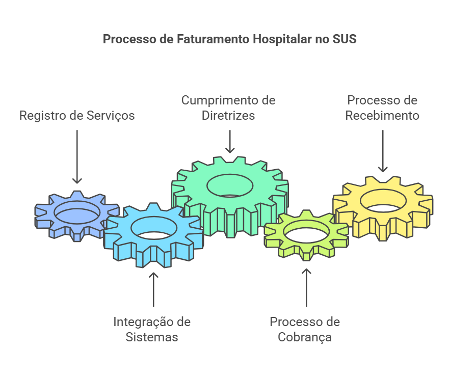
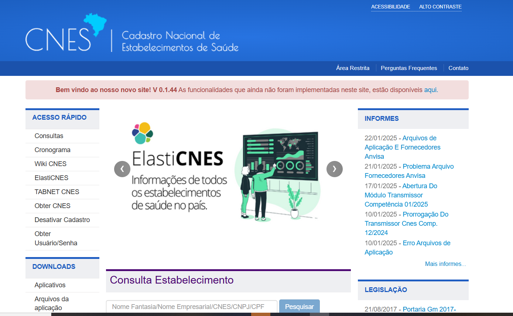

# 2. Fundamentos do Faturamento

## 2.1 Fundamentos

Os **fundamentos do faturamento hospitalar no SUS** são os alicerces que garantem que todo o processo de **registro, cobrança e recebimento** dos serviços prestados seja realizado de forma **adequada e eficiente**. Esses fundamentos envolvem um conjunto de **sistemas, cadastros e processos** que trabalham de forma integrada para assegurar que cada procedimento realizado seja **devidamente registrado e remunerado** conforme as normas e diretrizes estabelecidas pelo **Ministério da Saúde**.

<figure markdown>
  { width="600" }
  <figcaption>Fundamentos do faturamento. Elaboração própria</figcaption>
</figure>

Nesta seção, abordaremos os principais componentes que constituem os fundamentos do faturamento no SUS. Cada um desses componentes tem um papel **crucial no registro e na cobrança dos serviços de saúde**, e sua compreensão é essencial para garantir a eficiência do processo de faturamento. Os principais componentes que iremos abordar nas subseções seguintes são:

- **CNES (Cadastro Nacional de Estabelecimentos de Saúde)**: Responsável pelo registro dos estabelecimentos de saúde e seus serviços.
- **CNS (Cartão Nacional de Saúde)**: Utilizado para identificar de forma única os usuários do SUS.
- **SIGTAP (Sistema de Gerenciamento da Tabela de Procedimentos, Medicamentos e OPM do SUS)**: Ferramenta essencial para a **codificação e valoração** dos procedimentos realizados.
- **SIA/SUS (Sistema de Informação Ambulatorial)**: Sistema responsável pelo **registro e processamento dos procedimentos ambulatoriais** realizados, garantindo o controle e o faturamento adequado desses serviços.
- **BPA (Boletim de Produção Ambulatorial)**: Utilizado para registrar e faturar os procedimentos ambulatoriais.
- **APAC (Autorização de Procedimentos de Alta Complexidade)**: Autoriza e registra os procedimentos de alta complexidade.
- **AIH (Autorização de Internação Hospitalar)**: Documento essencial para o **registro e faturamento das internações hospitalares**.

Cada um desses elementos será detalhado nas subseções seguintes, com o objetivo de fornecer uma **visão clara e prática** de como eles se **integram ao processo de faturamento** da FHEMIG e do SUS.

---

## 2.2  Cadastro Nacional de Estabelecimentos de Saúde (CNES)

O [**Cadastro Nacional de Estabelecimentos de Saúde (CNES)**](https://cnes.datasus.gov.br/) é o sistema que mapeia a **capacidade instalada do Sistema Único de Saúde (SUS)**. Ele coleta dados sobre a **estrutura e os profissionais de saúde** nos estados e municípios, auxiliando os gestores no **planejamento das ações de saúde**.

<figure markdown>
  { width="600" }
  <figcaption>Página inicial do CNES. Elaboração própria.</figcaption>
</figure>

O CNES é destinado a toda a população brasileira e envolve os seguintes **atores e papéis**:

- **Estabelecimentos de saúde**: Registram todos os seus dados, SUS ou não SUS, por meio da aplicação disponibilizada pelo Ministério da Saúde e os enviam periodicamente.
- **Secretarias de Saúde**: Acessam os estabelecimentos de saúde do seu território por meio do CNES e são responsáveis pela manutenção dos dados dos estabelecimentos sob a gestão de cada ente federado.
- **Ministério da Saúde**: Acessa todos os estabelecimentos de saúde do país no CNES, além de monitorar indicadores de envio de dados por estados, municípios e regiões de saúde.
- **Cidadãos**: Podem consultar os estabelecimentos de saúde através da consulta pública no site do CNES **###COLOCAR LINKS##**, visualizando os dados públicos por meio de ferramentas como **Tabwin** e **Tabnet** **###COLOCAR LINKS##**.

O CNES coleta as seguintes **informações principais**:

- **Dados gerais básicos**
- **Endereço e localização**
- **Gestor responsável** (como secretarias de saúde)
- **Tipos de atendimento** (internações, ambulatórios, etc.)
- **Características do estabelecimento** (tipo, categoria, tributos, etc.)
- **Equipamentos disponíveis** (como RX, tomógrafo, ultrassom, etc.)
- **Serviços de apoio** (como serviços sociais e lavanderias)
- **Especialidades médicas** (como cardiologia e farmácia)
- **Estruturas físicas** (número de leitos, salas, etc.)
- **Profissionais que atuam** (no SUS e fora dele)
- **Equipes de saúde** (como as de saúde da família)
- **Cooperativas**

O cadastro no CNES serve como base para diversos sistemas, incluindo:

- **Sistema de Informação Ambulatorial (SIA/SUS)**
- **Sistema de Informação Hospitalar (SIH/SUS)**
- **Cartão Nacional de Saúde (CNS)**
- **Sistema de Informação de Regulação**
- **Sistema de Informação da Programação Pactuada e Integrada**
- **Sistema de Informações da Anvisa**
- **Sistema de Informações da ANS**
- **Gerenciador de Informações Locais (GIL)**

É de suma importância que os estabelecimentos de saúde mantenham seus dados no CNES **atualizados** para que os sistemas tenham conhecimento da **capacidade instalada** do local, incluindo estrutura física, habilitações e profissionais e suas especialidades. A falta de registro no CNES da capacidade do estabelecimento pode resultar em **glosas e bloqueios da AIH** (Autorização de Internação Hospitalar).

Os **artigos 371 e 372 da Portaria de Consolidação nº 01/GM/MS/2017 **###COLOCAR LINKS##**** estabelecem que a atualização do cadastro de estabelecimentos de saúde deve ocorrer em meio eletrônico, no mínimo mensalmente, ou sempre que houver alterações nas informações. O CNES permite a atualização diária da base nacional, possibilitando o envio de arquivos da base local para a Base de Dados Nacional do CNES sempre que houver necessidade.

Mesmo quando os dados cadastrais de um estabelecimento de saúde permanecem inalterados em uma competência, recomenda-se o envio mensal. Esse envio será reconhecido como **certidão negativa** e atualizará a data da última atualização nacional. As datas de envio e encerramento de cada competência podem ser consultadas no cronograma disponível no **Portal CNES**, no menu [Acesso Rápido/Cronograma](https://wiki.saude.gov.br/cnes/index.php/Cronograma).

---

## 2.3 Cartão Nacional de Saúde (CNS)

O [**Cartão Nacional de Saúde (CNS)**](https://www.gov.br/saude/pt-br/acesso-a-informacao/acoes-e-programas/cns) é o documento que **identifica o usuário do SUS**. Ele contém informações como **nome, data de nascimento, telefone, endereço, CPF, RG**, entre outros. O número do CNS funciona como uma **chave de integração** dos sistemas de saúde que precisam identificar pessoas, como pacientes, operadores ou profissionais de saúde. Isso possibilita a criação de um **histórico de atendimentos** de cada pessoa no SUS, permitindo o acesso a dados de sistemas como o de atenção básica, hospitalar e de dispensação de medicamentos, por exemplo.

Os principais **benefícios do CNS** incluem:

- **Identificação rápida do usuário**
- **Acesso ao prontuário** pelo número do cartão
- **Conexão entre profissional, paciente, hospital e atendimento**
- **Registro dos atendimentos, consultas e exames realizados**
- **Controle de medicamentos dispensados**
- **Atualização de dados cadastrais**

O CNS faz parte da política de **e-Saúde do Ministério da Saúde**, que visa organizar e integrar informações sobre pessoas, serviços de saúde e procedimentos. Isso facilita a **gestão do SUS** e o atendimento ao cidadão, além de ajudar os gestores e profissionais da saúde a realizarem um trabalho mais qualificado.

A partir do cadastramento do usuário e da emissão do CNS, com a integração dos sistemas por meio do número do cartão, torna-se possível **identificar o usuário em todos os seus contatos com o SUS** e acompanhar sua evolução dentro do sistema, com efeitos positivos tanto na **atenção individual** quanto no **planejamento das ações de saúde**.

Conforme a **Portaria Conjunta nº 2, de 15 de março de 2012** do Ministério da Saúde, o preenchimento do número do CNS do usuário é **obrigatório para o registro dos procedimentos ambulatoriais e hospitalares** nos instrumentos de registro das ações de saúde do Ministério da Saúde. O registro do número do CNS deve ser providenciado no ato da admissão do paciente.

Caso o usuário das ações e serviços de saúde não possua cadastro na **Base Nacional de Dados dos Usuários das Ações e Serviços de Saúde**, o estabelecimento de saúde deve realizar o cadastro por meio do aplicativo disponibilizado pelo DATASUS na internet.

O preenchimento do número do CNS é **opcional** nos instrumentos de registro das ações de saúde nos seguintes casos:

1. Para ações de saúde realizadas em **doadores falecidos**, conforme a Lei 9.434, de 04 de fevereiro de 2007.
2. Quando não for possível informar o número do CNS do paciente em atendimentos de **urgência, acidentes no local de trabalho, acidentes no trajeto para o trabalho**, outros tipos de acidentes de trânsito ou **outras lesões e envenenamentos**, conforme descrito na referida portaria.

O estabelecimento e o gestor de saúde devem apresentar **justificativa escrita** nos instrumentos de registro, descrevendo a razão da falta da informação do número do CNS na ação de saúde. As ações de saúde apresentadas sem o número do CNS estarão **bloqueadas nos sistemas de informação** e somente serão desbloqueadas mediante o aceite das justificativas pelas instâncias superiores.

É também **obrigatória a inclusão do número do CNS do profissional solicitante, executante e/ou autorizador** das ações de saúde nos instrumentos de registro, como:

1. **Autorizações de Internação Hospitalar (AIH)**
2. **Autorizações de Procedimentos Ambulatoriais (APAC)**
3. **Boletim de Produção Ambulatorial Individualizada (BPA I)**

## 2.3. Sistema de Gerenciamento da Tabela de Procedimentos, Medicamentos,Órteses, Próteses e Materiais Especiais do SUS (SIGTAP)

<! -- [ADICIONAR IMAGEM DO SIGTAP] -->

O **Sistema de Gerenciamento da Tabela de Procedimentos, Medicamentos, Órteses, Próteses e Materiais Especiais do SUS** é definido pela sigla **SIGTAP**. Trata-se de um ambiente virtual que permite a **consulta da Tabela de Procedimentos, Medicamentos, Órteses/Próteses e Materiais Especiais (OPM) do SUS**. O sistema é gerenciado pela **Coordenação Geral de Sistemas de Informação (CGSI/DRAC/SAS/MS)**, que disponibiliza a tabela de procedimentos do SUS, com todos os seus atributos, aos estabelecimentos de saúde credenciados ao SUS.

A instituição da **Tabela de Procedimentos, Medicamentos, Órteses/Próteses e Materiais Especiais** no SIGTAP foi feita pela **Portaria GM nº 321 de fevereiro de 2007**, e publicada pela **Portaria GM nº 2848 de novembro de 2007**. A legislação que regula o sistema de gestão da Tabela de Procedimentos do SUS é regida pela **Portaria de Consolidação nº 1, de 28 de setembro de 2017**.

Este instrumento de gestão possibilita **acesso à Tabela de Procedimentos do SUS** e o acompanhamento das **alterações realizadas a cada competência**, com detalhamento das características dos procedimentos, compatibilidades e relacionamentos.

O **SIGTAP** permite conhecer todas as características de um procedimento, como:

- **Tipo de financiamento**
- **Instrumento de registro**
- **Valor**
- **Classificação Brasileira de Ocupações (CBO)**
- **Classificação Internacional de Doenças (CID)**
- **Serviço/classificação**
- **Habilitações**
- **Incrementos financeiros**
- **Complexidade**

Além disso, o SIGTAP possibilita a extração de diversos **relatórios**, como o de relacionamento e o de compatibilidade entre procedimentos, que **norteiam as ações do faturamento da conta hospitalar**, indicando as principais alterações realizadas na Tabela de Procedimentos e os documentos que as originaram.

Portanto, o SIGTAP é uma ferramenta essencial para a **gestão do faturamento do SUS**, fornecendo todas as informações necessárias ao processo de faturamento e sendo indispensável para a **auditoria em saúde**.

## 2.4 Sistema de Informação Ambulatorial (SIA/SUS)

<! -- [ADICIONAR IMAGEM DO SIGTAP] -->

O **Sistema de Informação Ambulatorial (SIA)** surgiu da necessidade do **Ministério da Saúde** de criar um sistema de informação que permitisse o **registro padronizado** dos atendimentos ambulatoriais em **nível nacional**. O objetivo principal era gerar informações que facilitassem o **planejamento, controle, avaliação e auditoria** dos serviços prestados, principalmente com a **descentralização da gestão** do Sistema Único de Saúde (SUS).

O **SIA** foi implantado em **1995** em todo o território nacional. Inicialmente, entrou em funcionamento com o **Boletim de Produção Ambulatorial Consolidado (BPA-C)**, que registrava apenas o procedimento realizado e a quantidade, sem a identificação do paciente.

Em **1996**, foi instituída a **Autorização de Procedimentos Ambulatoriais de Alta Complexidade/Custo (APAC)**. Esse novo instrumento do SIA foi criado para contemplar os procedimentos ambulatoriais de **alta complexidade/custo**, incluindo informações detalhadas como:

- **Identificação do usuário atendido**;
- **Identificação do profissional executante**;
- **Diagnóstico do paciente**.

Com a instituição da **Tabela de Procedimentos, Medicamentos, Órteses/Próteses e Materiais Especiais (OPM) do SUS**, pela **Portaria GM/MS nº 321, de 8 de fevereiro de 2007**, as tabelas de procedimentos do **SIA** e do **SIH** foram **unificadas**.

O **SIA** é o sistema responsável por **gerir informações ambulatoriais do SUS** e subsidiar os gestores estaduais e municipais nos processos de:

- **Planejamento**;
- **Programação**;
- **Regulação**;
- **Avaliação**;
- **Controle**;
- **Auditoria** dos serviços de saúde.

As **principais finalidades** do SIA incluem:

- Registrar os atendimentos ambulatoriais do SUS de forma **padronizada**;
- Gerar dados e informações **estratégicas** para a gestão da saúde;
- Auxiliar no **planejamento, controle, avaliação e auditoria**;
- Viabilizar o **faturamento ambulatorial** dos serviços prestados.

O **SIA** permite o processamento das informações de atendimentos registrados nos **aplicativos de captação** utilizados pelos **prestadores públicos e privados contratados/conveniados pelo SUS**:

#### Componentes do SIA/SUS

Os componentes do sistema envolvem **sistemas de base**, **aplicativos de captação**, **aplicativos intermediários** e **tabelas**:

1. **Sistemas de Base**:
   - **Cadastro Nacional dos Estabelecimentos de Saúde (CNES)**;
   - **Sistema de Gerenciamento da Tabela de Procedimentos do SUS (SIGTAP)**.

2. **Aplicativos de Captação**:
   - **Boletim de Produção Ambulatorial (BPA)**:
     - **BPA-C** (Consolidado): Registra apenas a quantidade de procedimentos, sem identificação do paciente.
     - **BPA-I** (Individualizado): Registra informações detalhadas, incluindo a identificação do paciente.
   - **Autorização de Procedimentos Ambulatoriais (APAC)**:
     - Utilizada para registrar procedimentos de **alta complexidade** (AC) e alguns de **média complexidade** (MC), que exigem **autorização prévia** do gestor local.
   - **Registro de Ações Ambulatoriais de Saúde (RAAS)**:
     - Utilizado para registrar **procedimentos de atenção psicossocial**, financiados por meio de incentivos da **Rede de Atenção Psicossocial (RAPS)**.

3. **Aplicativos Intermediários**:
   - **Ficha de Programação Orçamentária (FPO)**:
     - Permite o registro da **programação física-orçamentária** dos estabelecimentos de saúde, coerente com o planejamento anual e contratos SUS.
   - **Transmissor**:
     - Facilita o **envio dos arquivos** do banco de dados local para o **Banco de Dados Nacional**, garantindo a integração das informações.

4. **Tabelas**:
   - **Banco de Dados do Sistema de Informação Ambulatorial (BDSIA)**:
     - Contém todos os **procedimentos, atributos e regras** vigentes na competência de processamento, conforme definidos no **SIGTAP**.
     - Disponibilizado mensalmente para **download** no portal do SIA, garantindo a **atualização** dos sistemas.

O **SIA/SUS** é, portanto, um **instrumento essencial** para a gestão da produção ambulatorial do SUS, contribuindo para a melhoria da qualidade das informações e para a otimização dos processos de planejamento e controle dos serviços de saúde.

#### 2.4.1 Boletim de Produção Ambulatorial (BPA)

O **Boletim de Produção Ambulatorial (BPA)** é um instrumento utilizado para **registrar os atendimentos ambulatoriais** que **não exigem autorização prévia** do gestor. O registro pode ser feito de duas formas:

1. **BPA-C (Consolidado)**: Não especifica o paciente atendido, registrando apenas a quantidade de procedimentos realizados.
2. **BPA-I (Individualizado)**: Identifica o paciente atendido e inclui informações detalhadas sobre os procedimentos realizados.

A **Tabela de Procedimentos, Órteses, Próteses e Materiais Especiais do SUS** define qual tipo de registro deve ser utilizado para cada procedimento. 

É importante destacar que **todos os procedimentos registrados no BPA-C também podem ser registrados no BPA-I**. Recomenda-se que as unidades de saúde utilizem preferencialmente o **BPA-I**, pois ele garante **maior qualidade das informações** e permite a identificação individualizada dos atendimentos.

Substituição pelo CMD

O **BPA** será gradualmente substituído pelo **Conjunto Mínimo de Dados da Atenção à Saúde (CMD)**, um sistema no qual **todos os atendimentos precisarão ser registrados individualmente**. A implantação do CMD será incremental e substituirá um total de **nove sistemas de informação atualmente utilizados**, que são:

1. **Boletim de Produção Ambulatorial (BPA)**;
2. **Autorização de Procedimento Ambulatorial (APAC)**;
3. **Registro das Ações Ambulatoriais de Saúde (RAAS)**;
4. **Autorização de Internação Hospitalar (SISAIH01)**;
5. **Coleta da Comunicação de Informação Hospitalar e Ambulatorial (CIHA01)**;
6. **Sistema de Informação Ambulatorial (SIA)**;
7. **Sistema de Informação Hospitalar (SIH)**;
8. **Processamento da Comunicação de Informação Hospitalar e Ambulatorial (CIHA02)**;
9. **Sistema de Regulação, Controle e Avaliação (SISRCA)**.

O processo de substituição visa a **unificação e individualização dos registros**, promovendo maior **precisão e qualidade das informações** no **SUS**.

## 2.5 Sistema de Informação Hospitalar - SIH/SUS

<! -- [ADICIONAR IMAGEM DO SIH/SUS] -->

O **Sistema de Informação Hospitalar (SIH/SUS)** teve suas origens em **1979**, quando o INAMPS e a DATAPREV desenvolveram o **Sistema de Assistência Médico-Hospitalar da Previdência Social/Autorização de Internação Hospitalar (SAMHPS/AIH)**. A principal inovação foi a substituição do pagamento por **item** da antiga **Guia de Internação Hospitalar (GIH)** por um pagamento **por pacote**, via **Autorização de Internação Hospitalar (AIH)**. Essa mudança trouxe previsibilidade ao faturamento hospitalar e aos gastos públicos.

Com a **descentralização** das unidades do INAMPS para as **Secretarias Estaduais de Saúde** e a inclusão de **diferentes prestadores de serviços hospitalares**, o sistema passou a ser denominado **Sistema de Informação Hospitalar (SIH)** do SUS, mantendo a **AIH** como o instrumento central.

#### A Autorização de Internação Hospitalar (AIH)

A **AIH** é utilizada para **registrar todos os atendimentos hospitalares** no SUS. Ela propõe um pagamento **fixo** pelos procedimentos médico-hospitalares e inclui:

- **Materiais utilizados**;
- **Procedimentos realizados**;
- **Profissionais envolvidos**;
- **Estrutura hospitalar necessária**.

#### Funcionalidades do SIH/SUS

Inicialmente estruturado com uma **perspectiva contábil**, o SIH expandiu seu uso ao fornecer **dados valiosos** sobre:

- **Diagnósticos**;
- **Demografia**;
- **Localização geográfica**;
- **Consumo de recursos** em cada internação hospitalar.

Atualmente, o **SIH/SUS** registra **mais de 10 milhões de AIHs aprovadas anualmente**. Além de ser essencial para o processamento das **internações hospitalares**, é uma **fonte importante de informações** para:

- **Perfil epidemiológico** da população brasileira;
- **Avaliação da qualidade da atenção à saúde** no país.

#### Qualidade das Informações no SIH

A qualidade das informações geradas pelo SIH é influenciada pelas **normatizações da assistência hospitalar** e pelas **políticas públicas de saúde do SUS**, que regulam o sistema e impactam as práticas hospitalares.

- Desde a sua criação, diversas **melhorias** foram implementadas para **garantir a qualidade das informações**.
- A exigência do **Cartão Nacional de Saúde (CNS)** na **AIH** permite a **identificação única dos usuários**, garantindo maior precisão nos registros.

Apesar de algumas **fragilidades persistentes**, o SIH/SUS tem sido amplamente utilizado para **avaliar a morbimortalidade hospitalar**, contribuindo para a **avaliação epidemiológica** e para a formulação de políticas de saúde pública.

#### Finalidades do SIH/SUS

As principais **finalidades** do Sistema de Informação Hospitalar (SIH) incluem:

- **Registrar os atendimentos** aos pacientes internados nos estabelecimentos de saúde do SUS;
- **Disponibilizar relatórios** para os gestores, com informações direcionadas aos setores de contas e custos hospitalares;
- **Fornecer conhecimento** sobre aspectos clínicos e epidemiológicos das internações hospitalares realizadas no SUS;
- **Viabilizar o faturamento** das internações hospitalares no SUS.

O **SIH/SUS** é, portanto, uma ferramenta essencial para a **gestão da saúde pública no Brasil**. Embora tenha surgido com a finalidade de **controle financeiro**, tornou-se um instrumento **fundamental** para o **registro e monitoramento das internações hospitalares**, fornecendo informações valiosas para **análises epidemiológicas** e para a **avaliação da qualidade da atenção à saúde** no Sistema Único de Saúde.

---

